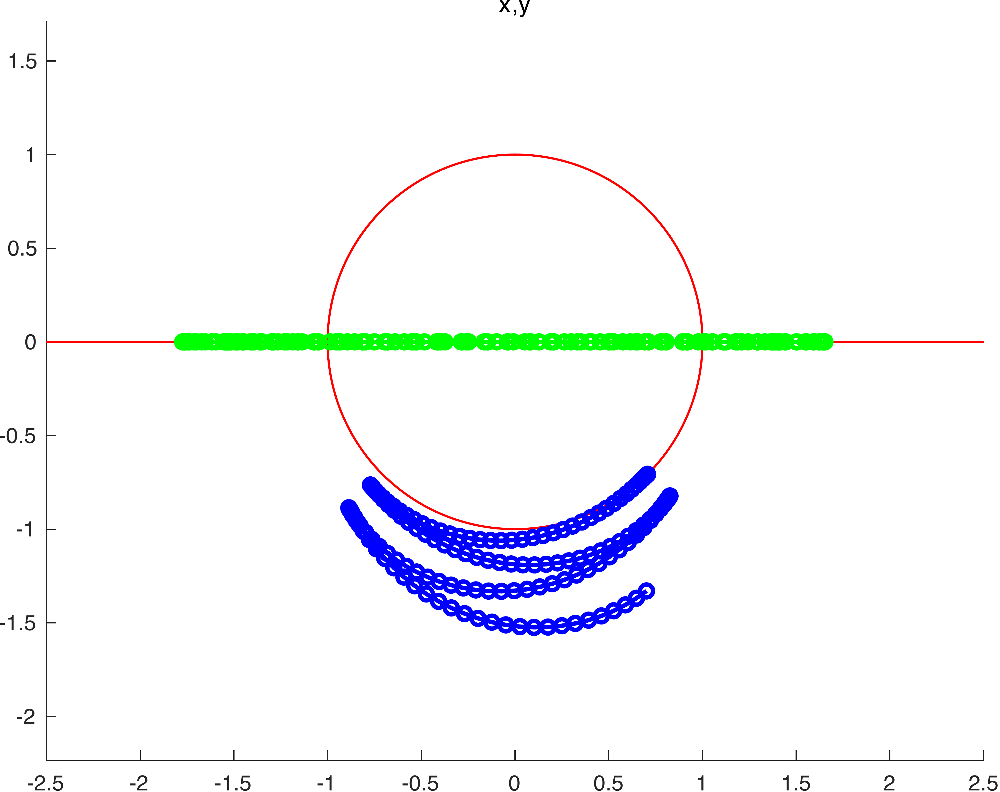

ODE solve example 7
===================

Load ODE
--------

Consider a crank-rod system described by the following DAE:

.. math::

  \begin{cases}
    x_1' = u_1 & \\
    y_1' = v_1 & \\
    x_2' = u_2 & \\
    y_2' = v_2 & \\
    \theta_2' = \omega_1 & \\
    \theta_2' = \omega_1 & \\
    m u_1' - \lambda_1 + \lambda_3 = 0 & \\
    m v_1' + mg-\lambda_2 = 0 & \\
    m u_2' - \lambda_3 = 0 & \\
    m v_2' + mg-\lambda_4 = 0 & \\
    -\lambda_1\ell\sin(\theta_1)-\lambda_2\ell\sin(\theta_1) = 0 & \\
    -\lambda_3\ell\sin(\theta_2) = 0 & \\
    x_1 - \ell\cos(\theta_1) = 0 & \\
    y_1 - \ell\cos(\theta_1) = 0 & \\
    x_2 - x_1 - \ell\cos(\theta_2) = 0 & \\
    y_2 = 0 & \\
    \ell\sin(\theta_1) - \ell\sin(\theta_2) = 0 &
  \end{cases}

If index is reduced, we obtain the ODE:

.. math::

  \begin{cases}
    x_1' = u_1 & \\
    y_1' = v_1 & \\
    x_2' = u_2 & \\
    y_2' = v_2 & \\
    \theta_2' = \omega_1 & \\
    \theta_2' = \omega_1 & \\
    u_1' = \dfrac{\lambda_3-\lambda_1}{m} & \\
    v_1' = \dfrac{\lambda_2 - mg}{m} & \\
    u_2' = \dfrac{\lambda_3}{m} & \\
    v_2' = \dfrac{\lambda_4 - mg}{m}  & \\
    \lambda_1' = -\dfrac{1}{\ell^2\sin(\theta_1)^4(4\cos(\theta_1))^2 - 5)}\dots & \\
    \lambda_2' = -\dfrac{1}{\ell^2\sin(\theta_1)^3(4\cos(\theta_1))^2 - 5)}\dots & \\
    \lambda_3' = -\dfrac{1}{\ell^2\sin(\theta_1)^4(4\cos(\theta_1))^2 - 5)}\dots & \\
    \lambda_4' = 0 & \\
    \lambda_5' = -\dfrac{1}{\ell^2\sin(\theta_1)^3\cos(\theta_1)(4\cos(\theta_1))^2 - 5)}\dots &
  \end{cases}

Define the class for the ODE to be integrated.
In this case the class ``CrankRod5EQ`` derived from
the base class ``DAC_ODEclass``.
The following is the contents of the file `CrankRod.m`

.. code:: matlab

  classdef CrankRod5EQ < DAC_ODEclass
    properties (SetAccess = protected, Hidden = true)
      ell;
      m;
      gravity;
      end
    methods
      function self = CrankRod5EQ( ell, m, gravity )
        self@DAC_ODEclass('CrankRod');
        self.ell     = ell;
        self.m       = m;
        self.gravity = gravity;
      end
      % - - - - - - - - - - - - - - - - - - - - - - - - - - - - - - - - - - -
      function ode = f( self, t, Z )
        g = self.gravity;
        m = self.m;
        L = self.ell;
        % extract states
        x_1 = Z(1);
        y_1 = Z(2);
        x_2 = Z(3);
        y_2 = Z(4);
        theta_1 = Z(5);
        theta_2 = Z(6);
        u_1 = Z(7);
        v_1 = Z(8);
        u_2 = Z(9);
        v_2 = Z(10);
        lambda_1 = Z(11);
        lambda_2 = Z(12);
        lambda_3 = Z(13);
        lambda_4 = Z(14);
        lambda_5 = Z(15);
        % evaluate function
        res_1 = u_1;
        res_2 = v_1;
        res_3 = u_2;
        res_4 = v_2;
        t3 = sin(theta_1);
        t4 = 0.1e1 / t3;
        res_5 = -u_1 / L * t4;
        res_6 = res_5;
        t6 = lambda_1 - lambda_3;
        t7 = 0.1e1 / m;
        res_7 = t6 * t7;
        t8 = m * g;
        res_8 = (-t8 + lambda_2) * t7;
        res_9 = t7 * lambda_3;
        res_10 = (-t8 + lambda_4) * t7;
        t12 = L * (lambda_1 + lambda_3);
        t13 = cos(theta_1);
        t14 = t13 ^ 2;
        t15 = t14 ^ 2;
        t16 = t15 * t13;
        t18 = L * t3;
        t24 = t14 * t13;
        t26 = t18 * lambda_2;
        t28 = u_1 ^ 2;
        t29 = t28 * m;
        t30 = 3 * t29;
        t40 = L ^ 2;
        t41 = 0.1e1 / t40;
        t42 = t3 ^ 2;
        t43 = t42 ^ 2;
        t48 = 0.1e1 / (4 * t14 - 5);
        t50 = u_1 * (t12 * t16 + t18 * t15 * lambda_2 + L * (lambda_1 - 5 * lambda_3) * t24 + (-2 * t26 - t30) * t14 - 2 * L * (lambda_1 - 2 * lambda_3) * t13 + t26) * t41 / t43 * t48;
        res_11 = -3 * t50;
        t63 = L * t6;
        res_12 = -(t12 * t15 + t18 * t24 * lambda_2 + 14 * L * (lambda_1 - 0.8e1 / 0.7e1 * lambda_3) * t14 + (-t26 - 15 * t29) * t13 - 15 * t63) * u_1 * t41 / t42 / t3 * t48;
        res_13 = -2 * t50;
        res_15 = 2 * (t63 * t16 + t18 * (lambda_2 - 2 * lambda_5) * t15 + L * (lambda_1 - lambda_3 / 2) * t24 + (-2 * L * (lambda_2 - 0.9e1 / 0.4e1 * lambda_5) * t3 - t30) * t14 - 2 * L * (lambda_1 - 0.3e1 / 0.4e1 * lambda_3) * t13 + t18 * (lambda_2 - 0.5e1 / 0.2e1 * lambda_5)) * u_1 * t41 * t4 / (4 * t15 - 9 * t14 + 5) / t13;
        % store on output
        ode = zeros(15,1);
        ode(1) = res_1;
        ode(2) = res_2;
        ode(3) = res_3;
        ode(4) = res_4;
        ode(5) = res_5;
        ode(6) = res_6;
        ode(7) = res_7;
        ode(8) = res_8;
        ode(9) = res_9;
        ode(10) = res_10;
        ode(11) = res_11;
        ode(12) = res_12;
        ode(13) = res_13;
        ode(15) = res_15;
      end
      % - - - - - - - - - - - - - - - - - - - - - - - - - - - - - - - - - - -
      function jac = DfDx( self, t, Z )
        g = self.gravity;
        m = self.m;
        L = self.ell;
        % extract states
        x_1 = Z(1);
        y_1 = Z(2);
        x_2 = Z(3);
        y_2 = Z(4);
        theta_1 = Z(5);
        theta_2 = Z(6);
        u_1 = Z(7);
        v_1 = Z(8);
        u_2 = Z(9);
        v_2 = Z(10);
        lambda_1 = Z(11);
        lambda_2 = Z(12);
        lambda_3 = Z(13);
        lambda_4 = Z(14);
        lambda_5 = Z(15);
        % evaluate function
        jac_1_7 = 1;
        jac_2_8 = 1;
        jac_3_9 = 1;
        jac_4_10 = 1;
        t1 = 0.1e1 / L;
        t2 = u_1 * t1;
        t3 = sin(theta_1);
        t4 = t3 ^ 2;
        t5 = 0.1e1 / t4;
        t6 = cos(theta_1);
        jac_5_5 = t2 * t5 * t6;
        t8 = 0.1e1 / t3;
        jac_5_7 = -t1 * t8;
        jac_6_5 = jac_5_5;
        jac_6_7 = jac_5_7;
        jac_7_11 = 0.1e1 / m;
        jac_7_13 = -jac_7_11;
        jac_8_12 = jac_7_11;
        jac_9_13 = jac_8_12;
        jac_10_14 = jac_9_13;
        t10 = L * t3;
        t11 = t6 ^ 2;
        t12 = t11 * t6;
        t13 = t11 ^ 2;
        t14 = t13 * t12;
        t18 = t13 ^ 2;
        t19 = L * t18;
        t24 = t13 * t6;
        t28 = t13 * t11;
        t29 = L * t28;
        t35 = u_1 ^ 2;
        t39 = t10 * t12 * lambda_2;
        t41 = L * t13;
        t52 = L * t11;
        t63 = 30 * t12 * m * t35 - 48 * t24 * m * t35 + 30 * t6 * m * t35 + 4 * t10 * t14 * lambda_2 - 11 * t10 * t24 * lambda_2 - 3 * t10 * t6 * lambda_2 + 10 * L * lambda_1 - 20 * L * lambda_3 + 4 * t19 * lambda_1 + 4 * t19 * lambda_3 + 29 * t29 * lambda_1 - 43 * t29 * lambda_3 - 66 * t41 * lambda_1 + 60 * t41 * lambda_3 + 23 * t52 * lambda_1 - t52 * lambda_3 + 10 * t39;
        t65 = L ^ 2;
        t66 = 0.1e1 / t65;
        t67 = t4 ^ 2;
        t72 = 4 * t11 - 5;
        t73 = t72 ^ 2;
        t74 = 0.1e1 / t73;
        t76 = u_1 * t63 * t66 / t67 / t3 * t74;
        jac_11_5 = 3 * t76;
        t78 = L * (lambda_1 + lambda_3);
        t79 = t78 * t24;
        t82 = t10 * t13 * lambda_2;
        t83 = 3 * t82;
        t87 = L * (lambda_1 - 5 * lambda_3) * t12;
        t89 = t10 * lambda_2;
        t91 = t35 * m;
        t98 = L * (lambda_1 - 2 * lambda_3) * t6;
        t103 = 0.1e1 / t67;
        t104 = 0.1e1 / t72;
        t105 = t103 * t104;
        jac_11_7 = (-3 * t79 - t83 - 3 * t87 + (6 * t89 + 27 * t91) * t11 + 6 * t98 - 3 * t89) * t66 * t105;
        t106 = t2 * t6;
        t107 = t11 + 2;
        t110 = t106 * t107 * t5 * t104;
        jac_11_11 = 3 * t110;
        t112 = t2 * t3 * t104;
        jac_11_12 = -3 * t112;
        t117 = t106 * (t11 - 4) * t5 * t104;
        jac_11_13 = 3 * t117;
        t121 = L * t14;
        t126 = L * t24;
        t137 = L * t12;
        t146 = L * t6;
        t152 = 210 * t11 * m * t35 - 240 * t13 * m * t35 - 6 * t10 * t11 * lambda_2 + 4 * t10 * t28 * lambda_2 + 4 * t121 * lambda_1 + 4 * t121 * lambda_3 + 181 * t126 * lambda_1 - 179 * t126 * lambda_3 - 390 * t137 * lambda_1 + 360 * t137 * lambda_3 + 205 * t146 * lambda_1 - 185 * t146 * lambda_3 - t83 + 5 * t89 + 75 * t91;
        jac_12_5 = u_1 * t152 * t66 * t103 * t74;
        t166 = L * (lambda_1 - lambda_3);
        jac_12_7 = (-t78 * t13 - t39 - 14 * L * (lambda_1 - 0.8e1 / 0.7e1 * lambda_3) * t11 + (t89 + 45 * t91) * t6 + 15 * t166) * t66 / t4 / t3 * t104;
        jac_12_11 = t2 * (t11 + 15) * t8 * t104;
        jac_12_12 = t2 * t6 * t104;
        jac_12_13 = t2 * (t11 - 15) * t8 * t104;
        jac_13_5 = 2 * t76;
        t184 = 18 * t91;
        jac_13_7 = (-2 * t79 - 2 * t82 - 2 * t87 + (4 * t89 + t184) * t11 + 4 * t98 - 2 * t89) * t66 * t105;
        jac_13_11 = 2 * t110;
        jac_13_12 = -2 * t112;
        jac_13_13 = 2 * t117;
        t195 = lambda_2 - 2 * lambda_5;
        t239 = t10 * (lambda_2 - 0.5e1 / 0.2e1 * lambda_5);
        jac_15_5 = 8 * (t166 * t18 * t6 + t10 * t195 * t18 + 0.25e2 / 0.4e1 * L * (lambda_1 - 0.19e2 / 0.25e2 * lambda_3) * t14 + (-0.15e2 / 0.4e1 * L * (lambda_2 - 0.12e2 / 0.5e1 * lambda_5) * t3 - 12 * t91) * t28 - 0.65e2 / 0.4e1 * L * (lambda_1 - 0.21e2 / 0.26e2 * lambda_3) * t24 + (0.23e2 / 0.4e1 * L * (lambda_2 - 0.121e3 / 0.46e2 * lambda_5) * t3 + 0.21e2 / 0.2e1 * t91) * t13 + 9 * L * (lambda_1 - 0.59e2 / 0.72e2 * lambda_3) * t12 + (-0.17e2 / 0.4e1 * L * (lambda_2 - 0.45e2 / 0.17e2 * lambda_5) * t3 + 0.15e2 / 0.4e1 * t91) * t11 + 0.5e1 / 0.4e1 * t239) * u_1 * t66 * t103 / t11 * t74;
        t278 = 0.1e1 / t6;
        jac_15_7 = (2 * t166 * t24 + 2 * t10 * t195 * t13 + 2 * L * (lambda_1 - lambda_3 / 2) * t12 + (-4 * L * (lambda_2 - 0.9e1 / 0.4e1 * lambda_5) * t3 - t184) * t11 - 4 * L * (lambda_1 - 0.3e1 / 0.4e1 * lambda_3) * t6 + 2 * t239) * t66 * t8 / (4 * t13 - 9 * t11 + 5) * t278;
        jac_15_11 = 2 * t2 * t107 * t8 * t104;
        jac_15_12 = -2 * t2 * t4 * t278 * t104;
        jac_15_13 = (-2 * u_1 * t11 - 3 * u_1) * t1 * t8 * t104;
        jac_15_15 = -t2 * t278;
        % store on output
        jac = zeros(15,15);
        jac(1,7) = jac_1_7;
        jac(2,8) = jac_2_8;
        jac(3,9) = jac_3_9;
        jac(4,10) = jac_4_10;
        jac(5,5) = jac_5_5;
        jac(5,7) = jac_5_7;
        jac(6,5) = jac_6_5;
        jac(6,7) = jac_6_7;
        jac(7,11) = jac_7_11;
        jac(7,13) = jac_7_13;
        jac(8,12) = jac_8_12;
        jac(9,13) = jac_9_13;
        jac(10,14) = jac_10_14;
        jac(11,5) = jac_11_5;
        jac(11,7) = jac_11_7;
        jac(11,11) = jac_11_11;
        jac(11,12) = jac_11_12;
        jac(11,13) = jac_11_13;
        jac(12,5) = jac_12_5;
        jac(12,7) = jac_12_7;
        jac(12,11) = jac_12_11;
        jac(12,12) = jac_12_12;
        jac(12,13) = jac_12_13;
        jac(13,5) = jac_13_5;
        jac(13,7) = jac_13_7;
        jac(13,11) = jac_13_11;
        jac(13,12) = jac_13_12;
        jac(13,13) = jac_13_13;
        jac(15,5) = jac_15_5;
        jac(15,7) = jac_15_7;
        jac(15,11) = jac_15_11;
        jac(15,12) = jac_15_12;
        jac(15,13) = jac_15_13;
        jac(15,15) = jac_15_15;
      end
      % - - - - - - - - - - - - - - - - - - - - - - - - - - - - - - - - - - -
      function plot( self, t, Z )
        g = self.gravity;
        m = self.m;
        L = self.ell;
        % extract states
        x_1 = Z(1);
        y_1 = Z(2);
        x_2 = Z(3);
        y_2 = Z(4);
        theta_1 = Z(5);
        theta_2 = Z(6);
        u_1 = Z(7);
        v_1 = Z(8);
        u_2 = Z(9);
        v_2 = Z(10);
        lambda_1 = Z(11);
        lambda_2 = Z(12);
        lambda_3 = Z(13);
        lambda_4 = Z(14);
        lambda_5 = Z(15);
        % plot
        x_0 = 0;
        y_0 = 0;
        xc1 = L*cos(0:pi/100:2*pi);
        yc1 = L*sin(0:pi/100:2*pi);
        hold off;
        plot( xc1, yc1, '-r', 'Linewidth', 1 );
        hold on
        axis_lim = L*2.5;
        xc2 = -axis_lim:0.05:axis_lim;
        yc2 = 0.0*(-axis_lim:0.05:axis_lim);
        plot( xc2, yc2, '-r', 'Linewidth', 1 );
        axis equal
        drawLine( x_0, y_0, x_1, y_1, 'LineWidth', 8, 'Color', 'r' );
        drawLine( x_1, y_1, x_2, y_2, 'LineWidth', 8, 'Color', 'r' );
        drawCOG(0.1*self.ell,x_0,y_0);
        fillCircle( 'b', x_1, y_1, 0.1*self.ell );
        fillCircle( 'b', x_2, y_2, 0.1*self.ell );
        xlim([ -axis_lim axis_lim ]);
        ylim([ -axis_lim axis_lim ]);
        title('x,y');
      end
    end
  end

Instantiate the ODE
-------------------

Having `CrankRod5EQ.m` now can instantiate the ODE

.. code:: matlab

  % load the Pendulum model in the variable ode
  ell     = 1.0;
  m       = 1.0;
  gravity = 9.81;
  ode     = CrankRod5EQ( ell, m, gravity );

Choose solver
-------------

Choose `ExplicitEuler` as solver and attach the
instantiated ode to it.

.. code:: matlab

  solver = ExplicitEuler(); % initialize solver
  solver.setODE(ode);       % Attach ode to the solver

Integrate
---------

Select the range and the sampling point for the numerical solution

.. code:: matlab

  Tmax = 7.5;
  h    = 0.05;
  tt   = 0:h:Tmax;

setup initial condition, use hidden constraint

.. math::

  \begin{cases}
    x_1 - \ell\cos(\theta_1) = 0 & \\
    y_1 - \ell\sin(\theta_1) = 0 & \\
    x_2 - x_1 - \ell\cos(\theta_1) = 0 & \\
    y_2 = 0 & \\
    -\lambda_1\ell\sin(\theta_1) + \lambda_2\ell\cos(\theta_1) - \lambda_5\ell\cos(\theta_1) = 0 & \\
    -\lambda_3\ell\sin(\theta_1)+\lambda_5\ell\cos(\theta_1)  = 0 & \\
    u_1 - \ell\omega\sin(\theta) = 0 & \\
    v_1 - \ell\omega\cos(\theta) = 0 & \\
    u_2 - u_1 - \ell\omega\sin(\theta) = 0 & \\
    u_2 - 2u_1 = 0 & \\
    v_2 = 0 & \\
    \dfrac{u_1\cos(\theta_1)}{\sin(\theta_1)} + \ell\omega^2\sin(\theta) = 0 & \\
    \dfrac{1}{m\ell\sin(\theta_1)^3}(-\ell(\lambda_1-\lambda_3)(\cos(\theta_1)^3)+\ell\sin(\theta_1)(mg-\lambda_2)(\cos(\theta_1)^2)+\ell(\lambda_1-\lambda_3)\cos(\theta_1)-\ell(mg-\lambda_2)\sin(\theta_1)+u_1^2m) = 0 & \\
    -\dfrac{2}{m\ell\sin(\theta_1)^4}(-3\lambda_3/2+\lambda_1)(\cos(\theta_1)+1)^2(\cos(\theta_1)-1)^2 = 0 & \\
    \dfrac{\lambda_4-mg}{m} = 0 &
  \end{cases}

to set consistent initial consdition

.. code:: matlab

  angle     = -pi/4;
  speed     = 0;
  x_10      = ell*cos(angle);
  y_10      = ell*sin(angle);
  x_20      = 2*ell*cos(angle);
  y_20      = 0;
  theta_10  = angle;
  theta_20  = angle;
  u_10      = -speed*ell*sin(angle);
  v_10      = speed*ell*cos(angle);
  u_20      = -2*speed*ell*sin(angle);
  v_20      = 0;
  lambda_10 = -3*cos(angle)*m*(ell*(speed^2)-sin(angle)*gravity)*(1/(4*sin(angle)^2+1));
  lambda_20 = -5*sin(angle)*m*(ell*(speed^2)-sin(angle)*gravity)*(1/(4*sin(angle)^2+1));
  lambda_30 = -2*cos(angle)*m*(ell*(speed^2)-sin(angle)*gravity)*(1/(4*sin(angle)^2+1));
  lambda_40 = m*gravity;
  lambda_50 = -2*sin(angle)*m*(ell*(speed^2)-sin(angle)*gravity)*(1/(4*sin(angle)^2+1));
  ini       = [ x_10; y_10; x_20; y_20; theta_10; theta_20; ...
                u_10; v_10; u_20; v_20; ...
                lambda_10; lambda_20; lambda_30; lambda_40; lambda_50 ];

compute numerical solution

.. code:: matlab

  sol = solver.advance( tt, ini );

now the matrix ``sol`` contain the solution.
The first column contain \(\theta\) the second column
contains  \(\omega\).

Extract solution
----------------

.. code:: matlab

  x_1     = sol(1,:);
  y_1     = sol(2,:);
  x_2     = sol(3,:);
  y_2     = sol(4,:);
  theta_1 = sol(5,:);
  theta_2 = sol(6,:);
  u_1     = sol(7,:);
  v_1     = sol(8,:);
  u_2     = sol(9,:);
  v_2     = sol(10,:);

Plot the solution
-----------------

.. code:: matlab

  % sample a circle and plot (the constraint)
  xc1 = ell*cos(0:pi/100:2*pi);
  yc1 = ell*sin(0:pi/100:2*pi);
  plot( xc1, yc1, '-r', 'Linewidth', 1 );
  hold on
  axis_lim = ell*2.2;
  xc2 = -axis_lim:0.05:axis_lim;
  yc2 = 0.0*(-axis_lim:0.05:axis_lim);
  plot( xc2, yc2, '-r', 'Linewidth', 1 );
  axis equal
  plot( x_1, y_1, '-o', 'MarkerSize', 6, 'Linewidth', 2, 'Color', 'blue' );
  plot( x_2, y_2, '-o', 'MarkerSize', 6, 'Linewidth', 2, 'Color', 'green' );
  xlim([-axis_lim axis_lim])
  ylim([-axis_lim axis_lim])
  title('x,y');

.. code:: matlab

  ode.animate_plot( tt, sol, 10, 1 );

.. image:: ./images/Manual_ODE_TEST7_mov1.mp4
   :width: 90%
   :align: center
