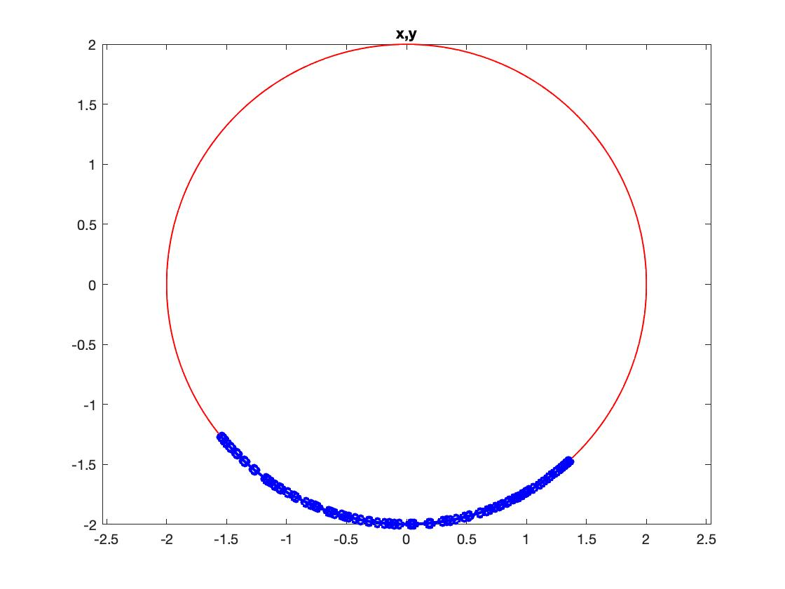
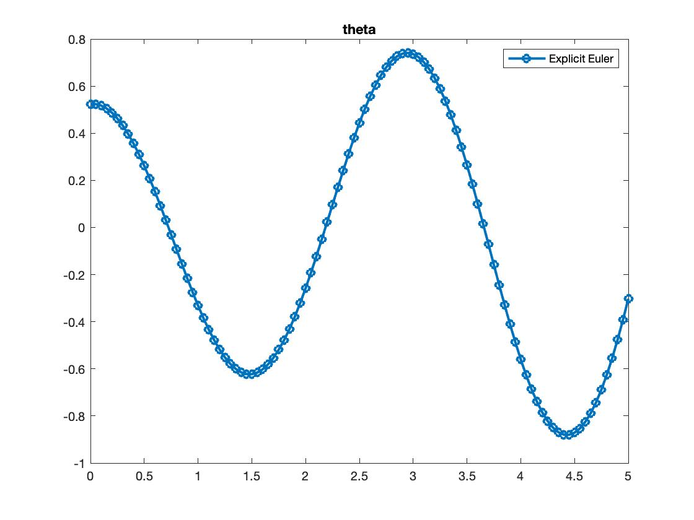
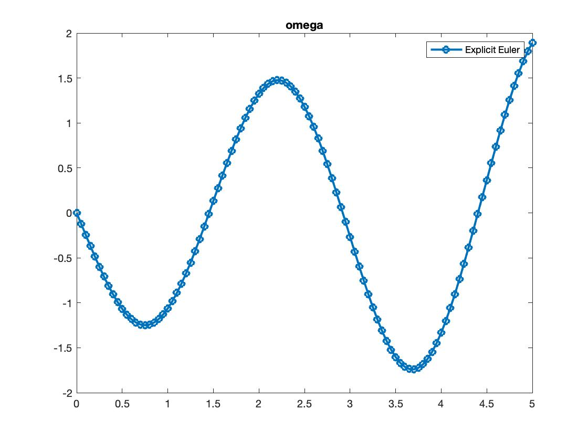

ODE solve example
=================

Load ODE
--------

Consider the ODE :math:`\sin(x)^2+\dfrac{1}{2}`:

.. math::

  \begin{cases}
     \theta' = \omega & \\
     \omega' = -\displaystyle\frac{g}{\ell}\sin\theta &
  \end{cases}

Define the class for the ODE to be integrated.
In this case the class ``Pendulum2EQ`` derived from 
the base class ``ODEbaseClass``.
The following is the contents of the file `Pendulum2EQ.m`

.. code:: matlab

  classdef Pendulum2EQ < ODEbaseClass
    properties (SetAccess = protected, Hidden = true)
      ell;
      gravity;
    end
    methods
      function self = Pendulum2EQ( ell, gravity )
        self@ODEbaseClass('Pendulum2EQ');
        self.ell     = ell;
        self.gravity = gravity;
      end
      function ode = f( self, t, Z )
        % extract components
        theta  = Z(1);
        omega  = Z(2);
        % get parameters of the ODE
        g      = self.gravity; 
        ell    = self.ell;
        ode    = zeros(2,1);
        % build rhs
        ode(1) = omega;
        ode(2) = -(g/ell)*sin(theta);
      end
      function jac = DfDx( self, t, Z )
        % evaluate Jacobian of rhs.
        % Necessary only for implicit solver
        theta    = Z(1);
        omega    = Z(2);
        g        = self.gravity;
        ell      = self.ell;
        jac      = zeros(2,2);
        jac(1,2) = 1;
        jac(2,1) = -(g/ell)*cos(theta);
      end
      function res = DfDt( self, t, x )
        res = zeros(2,1);
      end
      function res = exact( self, t0, x0, t )
        res = []; % no exact solution known
      end
    end
  end

Instantiate the ODE
-------------------

Having `Pendulum2EQ.m` now can instantiate the ODE

.. code:: matlab

  % load the Pendulum model in the variable ode
  ell     = 2;
  gravity = 9.81;
  ode     = Pendulum2EQ( ell, gravity );

Choose solver
-------------

Choose `ExplicitEuler` as solver and attach the
instantiated ode to it.

.. code:: matlab

  solver = ExplicitEuler(); % initialize solver
  solver.setODE(ode);       % Attach ode to the solver

Integrate
---------

Select the range and the sam pling point for the numerical solution

.. code:: matlab

  Tmax = 5;
  h    = 0.05;
  tt   = 0:h:Tmax;

setup initial condition

.. code:: matlab

  theta0  = pi/6;
  omega0  = 0;
  ini     = [theta0;omega0];

compute numerical solution

.. code:: matlab
  
  sol = solver.advance( tt, ini );

now the matrix ``sol`` contain the solution.
The first column contain \(\theta\) the second column
contains  \(\omega\).

Extract solution
----------------

.. code:: matlab

  theta = sol(1,:);
  omega = sol(2,:);
  x = ell*sin(theta);
  y = -ell*cos(theta);

Plot the solution
-----------------

.. code:: matlab

  % sample a circle and plot (the constraint) 
  xx = ell*cos(0:pi/100:2*pi);
  yy = ell*sin(0:pi/100:2*pi);
  plot( xx, yy, '-r', 'Linewidth', 1 );
  hold on
  axis equal
  plot( x, y, '-o', 'MarkerSize', 6, 'Linewidth', 2, 'Color', 'blue' );
  title('x,y');

.. code:: matlab

  plot( tt, theta, '-o', 'MarkerSize', 6, 'Linewidth', 2 );
  hold on;
  legend('Explicit Euler');
  title('theta');

.. code:: matlab

  plot( tt, omega, '-o', 'MarkerSize', 6, 'Linewidth', 2 );
  hold on;
  legend('Explicit Euler');
  title('omega');

