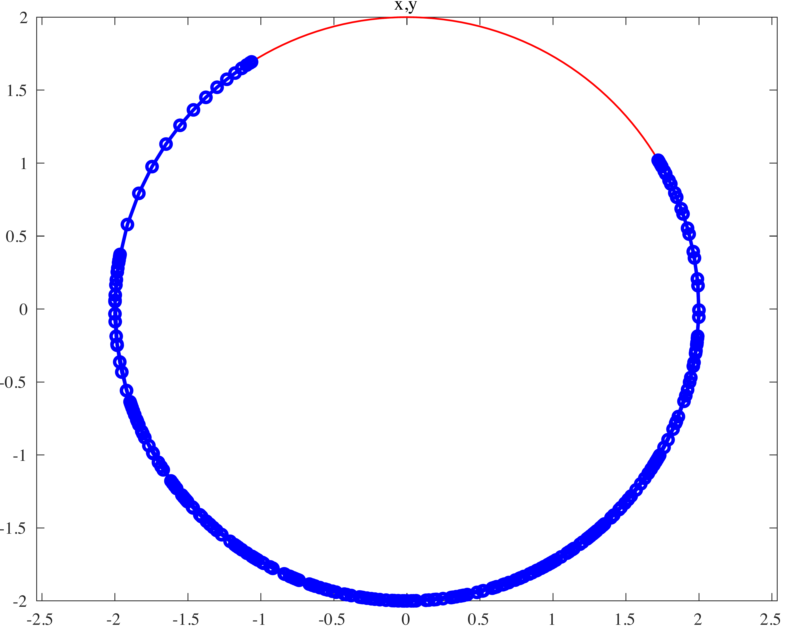
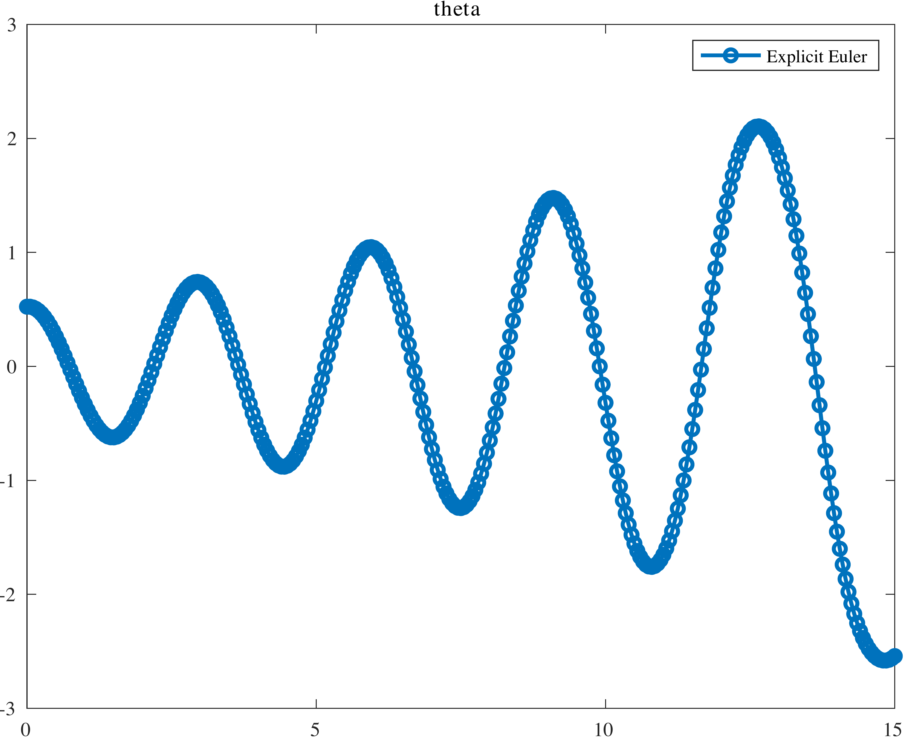
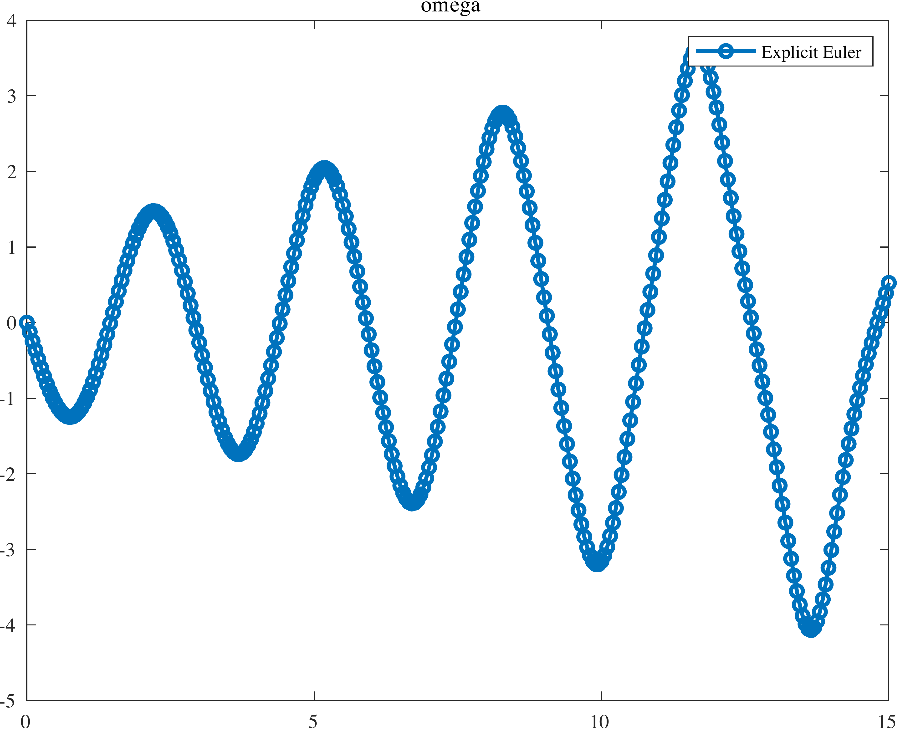

ODE solve example 1
===================

.. image:: images/simple-pendulum.svg
    :align: center
    :width: 25%

Load ODE
--------

Consider the ODE:

.. math::

  \begin{cases}
     \theta' = \omega & \\
     \omega' = -\displaystyle\frac{g}{\ell}\sin\theta &
  \end{cases}

Define the class for the ODE to be integrated.
In this case the class ``LinearPendulumODE`` derived from
the base class ``LinearPendulumODE``.
The following is the contents of the file `LinearPendulumODE.m`

.. code-block:: matlab

  classdef LinearPendulumODE < DIAL_ODEsystem
    %
    properties (SetAccess = protected, Hidden = true)
      %
      %> Pendulum mass (kg)
      %
      m_m;
      %
      %> Pendulum length (m)
      %
      m_l;
      %
      %> Gravity acceleration (m/s^2)
      %
      m_g;
    end
    %
    methods
      %
      % - - - - - - - - - - - - - - - - - - - - - - - - - - - - - - - - - - -
      %
      function this = LinearPendulumODE( m, l, g )
        neq  = 2;
        ninv = 0;
        this@DIAL_ODEsystem( 'LinearPendulumODE', neq, ninv );
        this.m_m = m;
        this.m_l = l;
        this.m_g = g;
      end
      %
      % - - - - - - - - - - - - - - - - - - - - - - - - - - - - - - - - - - -
      %
      function out = f( this, ~, X )
        out    = zeros(2,1);
        out(1) = X(2);
        out(2) = -this.m_g / this.m_l * X(1);
      end
      %
      % - - - - - - - - - - - - - - - - - - - - - - - - - - - - - - - - - - -
      %
      function out = DfDx( this, ~, ~ )
        out      = zeros(2,2);
        out(1,2) = 1.0;
        out(2,1) = -this.m_g / this.m_l;
      end
      %
      % - - - - - - - - - - - - - - - - - - - - - - - - - - - - - - - - - - -
      %
      function h( ~, ~, ~ )
      end
      %
      % - - - - - - - - - - - - - - - - - - - - - - - - - - - - - - - - - - -
      %
      function DhDx( ~, ~, ~ )
      end
      %
      % - - - - - - - - - - - - - - - - - - - - - - - - - - - - - - - - - - -
      %
      function plot( this, ~, X )
        x  =  this.m_l*sin(X(1));
        y  = -this.m_l*cos(X(1));
        x0 = 0;
        y0 = 0;
        tt = 0:pi/100:2*pi;
        xx = this.m_l*cos(tt);
        yy = this.m_l*sin(tt);
        hold off;
        plot(xx, yy, 'LineWidth', 1.0, 'Color', 'red');
        hold on;
        grid on; grid minor;
        xlabel('$x$(m)');
        ylabel('$y$(m)');
        l = 1.1*this.m_l;
        drawLine(x0, y0, x, y, 'LineWidth', 5, 'Color', 'k');
        drawCOG( 0.1*this.m_l, x0, y0 );
        fillCircle( 'r', x, y, 0.1*this.m_l );
        xlim([-l, l]);
        ylim([-l, l]);
        axis equal;
      end
      %
      % - - - - - - - - - - - - - - - - - - - - - - - - - - - - - - - - - - -
      %
      function out = exact( this, x_i, t )
        sqrt_g_l = sqrt(this.m_g / this.m_l);
        out      = zeros(2,length(t));
        out(1,:) = -sqrt_g_l .* x_i(2) .* sin(sqrt_g_l .* t) + x_i(1) * cos(sqrt_g_l .* t);
        out(2,:) = sqrt_g_l .* (sqrt_g_l .* x_i(2) .* cos(sqrt_g_l .* t) - x_i(1) * sin(sqrt_g_l .* t));
      end
      %
      %
      % - - - - - - - - - - - - - - - - - - - - - - - - - - - - - - - - - - -
      %
    end
    %
  end

Instantiate the ODE
-------------------

Having `LinearPendulumODE.m` now can instantiate the ODE:

.. code:: matlab

  % Load the linear pendulum model
  m = 1.0;  % Mass (kg)
  l = 1.0;  % Length (m)
  g = 9.81; % Gravity (m/s^2)
  ODE = LinearPendulumODE( m, l, g );

Choose solver
-------------

Choose `ExplicitEuler` as solver and attach the instantiated
ODE to it:

.. code:: matlab

  solver = ExplicitEuler(); % Initialize solver
  solver.setODE(ODE);       % Attach ODE to the solver

Integrate
---------

Select the range and the sampling point for the numerical solution:

.. code:: matlab

    d_t   = 0.05; % (s)
    T_ini = 0.0;  % (s)
    T_end = 10.0; % (s)
    tt = T_ini:d_t:T_end;

Setup initial condition:

.. code:: matlab

  theta0  = pi/6;
  omega0  = 0;
  ini     = [theta0;omega0];

Compute numerical solution:

.. code:: matlab

  sol = solver.advance( tt, ini );

now the matrix ``sol`` contain the solution.
The first column contain \(\theta\) the second column
contains  \(\omega\).

Extract solution
----------------

.. code:: matlab

  theta = sol(1,:);
  omega = sol(2,:);
  x =  l*sin(theta);
  y = -l*cos(theta);

Plot the solution
-----------------

.. code:: matlab

  % Sample a circle and plot (the constraint)
  xx = l*cos(0:pi/100:2*pi);
  yy = l*sin(0:pi/100:2*pi);
  plot( xx, yy, '-r', 'Linewidth', 1 );
  hold on
  axis equal
  plot( x, y, '-o', 'MarkerSize', 6, 'Linewidth', 2, 'Color', 'blue' );
  title('x,y');

.. code:: matlab

  plot( tt, theta, '-o', 'MarkerSize', 6, 'Linewidth', 2 );
  hold on;
  legend('Explicit Euler');
  title('theta');

.. code:: matlab

  plot( tt, omega, '-o', 'MarkerSize', 6, 'Linewidth', 2 );
  hold on;
  legend('Explicit Euler');
  title('omega');

.. code:: matlab

  ode.animatePlot( tt, sol, 10, 1 );

.. image:: ./images/Manual_ODE_TEST1_mov1.mp4
   :width: 90%
   :align: center
