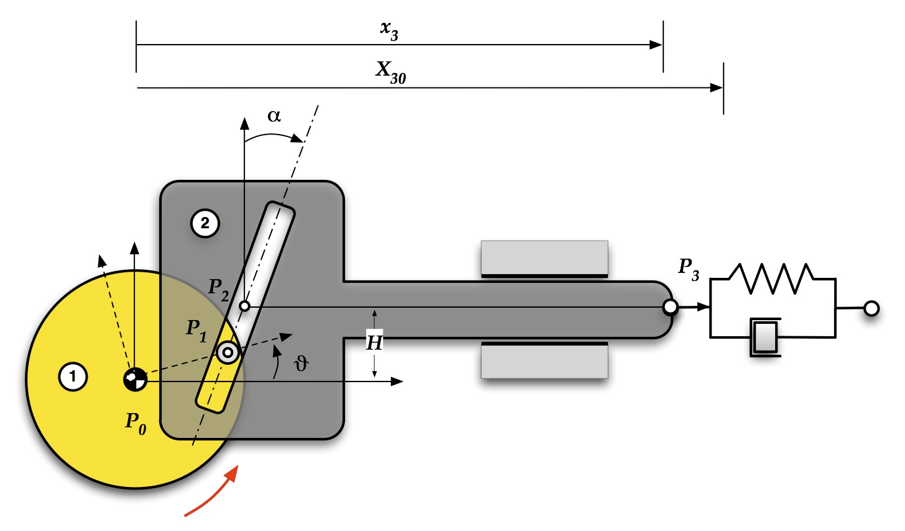
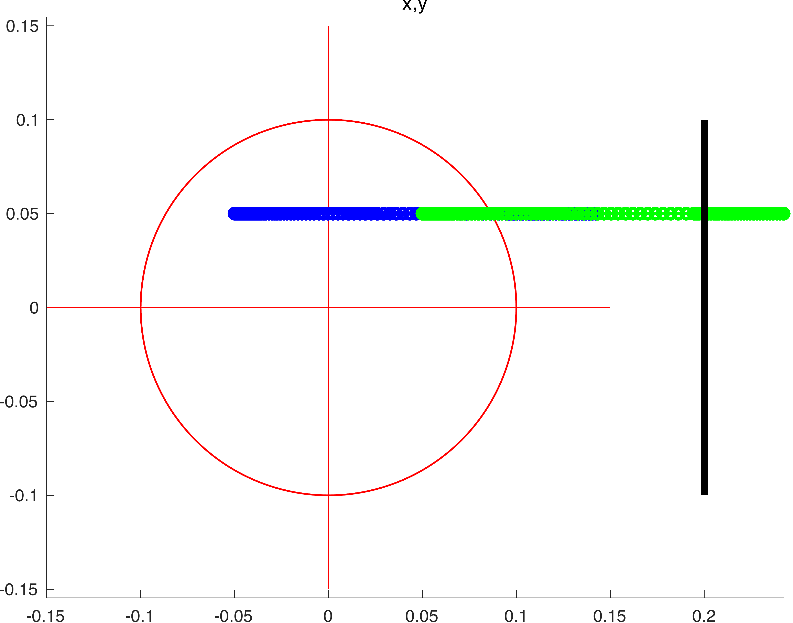

ODE solve example 10
====================

Load ODE
--------

Consider a Scotch-Yoke system described by the following DAE (14 equations):

.. math::

  \begin{cases}
    x2' = x2_{dot} & \\
    s' = s_{dot} & \\
    \theta' = \theta_{dot} & \\
    x2_{dot}' m2 + \lambda_1 - min(0 & \\
    -(L + x2 - X30)k - x2_{dot}c) & \\
    -\sin(\alpha)\lambda_1 + \cos(\alpha)\lambda_2 & \\
    \theta_{dot}' iz1 + R(\lambda_1\sin(\theta) - \lambda_2\cos(\theta)) - T & \\
    -\cos(\theta)R - s\sin(\alpha) + x2 & \\
    -\sin(\theta)R + s\cos(\alpha) + H &
  \end{cases}

MAPLE
-----

Load maple toolbox

.. code-block:: maple

    > read("{PATH}/DAE-toolbox.maplet");

Define ODE and constranints

.. code-block:: maple

    > EQ1  := diff(x2(t),t)=x2__dot(t);
    > EQ2  := diff(s(t),t)=s__dot(t);
    > EQ3  := diff(theta(t),t)=theta__dot(t);
    > EQ4  := diff(x2__dot(t),t)*m2+lambda__1(t)-min(0,-(L+x2(t)-X30)*k-x2__dot(t)*c)=0;
    > EQ5  := diff(theta__dot(t),t)*iz1-R*(lambda__2(t)*cos(theta(t))-lambda__1(t)*sin(theta(t)))-T=0;
    > ALG1 := -sin(alpha)*lambda__1(t)+cos(alpha)*lambda__2(t)=0;
    > ALG2 := -cos(theta(t))*R-s(t)*sin(alpha)+x2(t)=0;
    > ALG3 := -sin(theta(t))*R+s(t)*cos(alpha)+H0=0;

Define variables (and differential of its)

.. code-block:: maple

    > VARS  := [x(t),y(t),u(t),v(t),lambda(t)];
    > DVARS := map(diff,VARS,t)

Use toolbox to separate differential and algebraic
part and build the matrix ``E`` for differetial part of the DAE.

.. code-block:: maple

    > E1, G1, A1, r := DAE_separate_algebraic_bis( [EQ||(1..4),ALG], DVARS );

Reduce by 1 the index

.. code-block:: maple

    > E2, G2, A2, r := DAE_reduce_index_by_1( E1, G1, A1, DVARS );

Reduce (again) by 1 the index

.. code-block:: maple

    > E3, G3, A3, r := DAE_reduce_index_by_1( E2, G2, A2, DVARS );

Reduce (one more) by 1 the index

.. code-block:: maple

    > E4, G4, A4, r := DAE_reduce_index_by_1( E3, G3, A3, DVARS );

Now is an ODE, 3 index reduction appllied,
original DAE of index 3.

.. code-block:: maple

    > RHS := collect(simplify(LinearSolve( E4, G4 )),[m,lambda]);

Build Jacobian of RHS of ODE:

.. code-block:: maple

    > JODE := map(simplify,JACOBIAN(RHS_ODE,VARS));

Build the map with the hidden constraints and its Jacobian:

.. code-block:: maple

    > A := <A1,A2,A3>;
    > JA := map(simplify,JACOBIAN(A,VARS));

If index is reduced, we obtain the following ODE:

.. math::

  \begin{cases}
    x2' = x2_{dot} & \\
    s' = s_{dot} & \\
    \theta' = \theta_{dot} & \\
    x2_{dot}' = (-\lambda_1 + min(0 & \\
    -(L + x2 - X30)k - x2_{dot}c))/m2 & \\
    s_{dot}' = R(R\lambda_2\cos(\theta)^2 + (-\sin(\theta)R\lambda_1 + T)\cos(\theta) - \theta_{dot}^2\sin(\theta)iz1)/(\cos(\alpha)iz1) & \\
    \theta_{dot} = (\cos(\theta)R\lambda_2 - \sin(\theta)R\lambda_1 + T)/iz1 & \\
    \lambda_1' = -4\cos(\alpha)(-1/4iz1 \text{piecewise}(0 <= (L + x2 - X30)k + x2_{dot}c((c^2 - km2)x2_{dot} + (\lambda_1 + (L \dots & \\
    \qquad + x2 - X30)k)c)/m2(L + x2 - X30)k + x2_{dot}c <0, 0)\sin(\alpha)\cos(\alpha) + (R(\cos(\alpha)^2\lambda_1 - \cos(\alpha)\lambda_2\sin(\alpha) \dots & \\
    \qquad - \lambda_1)\cos(\theta)^2 + (R(\cos(\alpha)^2\lambda_2 + \cos(\alpha)\lambda_1\sin(\alpha) - \lambda_2)\sin(\theta) + 1/4\cos(\alpha)^2\theta_{dot}^2iz1 - 3/4\cos(\alpha)\sin(\alpha)T \dots & \\
    \qquad - 1/4\theta_{dot}^2iz1)\cos(\theta) + (1/4\cos(\alpha)\sin(\alpha)\theta_{dot}^2iz1 + 3/4\cos(\alpha)^2T - 3/4T)\sin(\theta) - (3/4\cos(\alpha)^2\lambda_1 \dots & \\
    \qquad - 1/4\cos(\alpha)\lambda_2\sin(\alpha) - 3/4\lambda_1)R)R\theta_{dot}m2)/(-2\sin(\alpha)(\cos(\alpha)^2 - 1/2)R^2m2\cos(\theta)^2 + 2\cos(\alpha)R^2\sin(\theta) \dots & \\
    \qquad m2(\cos(\alpha) - 1)(\cos(\alpha) + 1)\cos(\theta) + \cos(\alpha)^2\sin(\alpha)(R^2m2 + iz1)) & \\
    \lambda_2' = -4\sin(\alpha)(-1/4iz1 \text{piecewise}(0 <= (L + x2 - X30)k + x2_{dot}c((c^2 - km2)x2_{dot} + (\lambda_1 + (L \dots & \\
    \qquad + x2 - X30)k)c)/m2(L + x2 - X30)k + x2_{dot}c <0, 0)\sin(\alpha)\cos(\alpha) + (R(\cos(\alpha)^2\lambda_1 - \cos(\alpha)\lambda_2\sin(\alpha) -  \dots & \\
    \qquad - \lambda_1)\cos(\theta)^2 + (R(\cos(\alpha)^2\lambda_2 + \cos(\alpha)\lambda_1\sin(\alpha) - \lambda_2)\sin(\theta) + 1/4\cos(\alpha)^2\theta_{dot}^2iz1 - 3/4\cos(\alpha)\sin(\alpha)T \dots & \\
    \qquad - 1/4\theta_{dot}^2iz1)\cos(\theta) + (1/4\cos(\alpha)\sin(\alpha)\theta_{dot}^2iz1 + 3/4\cos(\alpha)^2T - 3/4T)\sin(\theta) - (3/4\cos(\alpha)^2\lambda_1 \dots & \\
    \qquad - 1/4\cos(\alpha)\lambda_2\sin(\alpha) - 3/4\lambda_1)R)R\theta_{dot}m2)/(-2\sin(\alpha)(\cos(\alpha)^2 - 1/2)R^2m2\cos(\theta)^2 + 2\cos(\alpha)R^2\sin(\theta) \dots & \\
    \qquad m2(\cos(\alpha) - 1)(\cos(\alpha) + 1)\cos(\theta) + \cos(\alpha)^2\sin(\alpha)(R^2m2 + iz1)) &
  \end{cases}

Define the class for the ODE to be integrated.
In this case the class ``ScotchYoke`` derived from
the base class ``DAC_ODEclass``.
The following is the contents of the file `ScotchYoke.m`

.. code-block:: matlab

  classdef ScotchYoke < DAC_ODEclass
    properties (SetAccess = protected, Hidden = true)
        m1;
        m2;
        iz1;
        iz2;
        R;
        H;
        L;
        alpha;
        X30;
        k;
        c;
        T;
    end
    methods
      function self = ScotchYoke( m1, m2, iz1, iz2, R, H, L, alpha, X30, k, c, T )
        neq  = 8;
        ninv = 6;
        self@DAC_ODEclass( 'ScotchYoke', neq, ninv );
        self.m1    = m1;
        self.m2    = m2;
        self.iz1   = iz1;
        self.iz2   = iz2;
        self.R     = R;
        self.H     = H;
        self.L     = L;
        self.alpha = alpha;
        self.X30   = X30;
        self.k     = k;
        self.c     = c;
        self.T     = T;
      end
      % - - - - - - - - - - - - - - - - - - - - - - - - - - - - - - - - - - -
      function res__f = f( self, t, vars__ )
        % ...
      end
      % - - - - - - - - - - - - - - - - - - - - - - - - - - - - - - - - - - -
      function res__DfDx = DfDx( self, t, vars__ )
        % ...
      end
      % - - - - - - - - - - - - - - - - - - - - - - - - - - - - - - - - - - -
      function res__DfDt = DfDt( self, t, vars__ )
        % ...
      end
      % - - - - - - - - - - - - - - - - - - - - - - - - - - - - - - - - - - -
      function res__h = h( self, t, vars__ )
        % ...
      end
      % - - - - - - - - - - - - - - - - - - - - - - - - - - - - - - - - - - -
      function res__DhDx = DhDx( self, t, vars__ )
        % ...
      end
      % - - - - - - - - - - - - - - - - - - - - - - - - - - - - - - - - - - -
      function res__DhDt = DhDt( self, t, vars__ )
        % ...
      end
      % - - - - - - - - - - - - - - - - - - - - - - - - - - - - - - - - - - -
      function plot( self, t, Z )
        % ...
      end
    end
  end

To define the methods you need the MAPLE
substitution (make a function ``fun(x)`` as the symbol ``fun``)

.. code-block:: maple

    > REMOVE_T := map(x->x=op(0,x),VARS);

Method f(t,x)
~~~~~~~~~~~~~

Implementation of RHS of ODE.
Use maple command

.. code-block:: maple

    > F_TO_MATLAB( <subs(REMOVE_T,RHS)>, subs(REMOVE_T,VARS), "f");

The lines highlighted which remap model parameters
are not automatically generated.

.. code-block:: matlab
    :emphasize-lines: 2-13

      function res__f = f( self, t, vars__ )
        m1    = self.m1;
        m2    = self.m2;
        iz1   = self.iz1;
        iz2   = self.iz2;
        R     = self.R;
        H     = self.H;
        L     = self.L;
        alpha = self.alpha;
        X30   = self.X30;
        k     = self.k;
        c     = self.c;
        T     = self.T;

        % extract states
        x2         = vars__(1);
        s          = vars__(2);
        theta      = vars__(3);
        x2__dot    = vars__(4);
        s__dot     = vars__(5);
        theta__dot = vars__(6);
        lambda__1  = vars__(7);
        lambda__2  = vars__(8);
        % evaluate function
        res__1 = x2__dot;
        res__2 = s__dot;
        res__3 = theta__dot;
        t5 = min(0, (-L - x2 + X30) * k - x2__dot * c);
        t7 = 0.1e1 / m2;
        res__4 = t7 * (-lambda__1 + t5);
        t9 = cos(theta);
        t10 = t9 ^ 2;
        t12 = R ^ 2;
        t13 = m2 * t12;
        t16 = R * lambda__2;
        t17 = sin(theta);
        t18 = t17 * t16;
        t19 = theta__dot ^ 2;
        t20 = iz1 * t19;
        t24 = R * t17;
        t30 = 0.1e1 / iz1;
        t32 = sin(alpha);
        res__5 = 0.1e1 / t32 * t7 * t30 * (t5 * iz1 + t13 * lambda__1 * t10 + t9 * (t18 + t20) * m2 * R + T * m2 * t24 - (t13 + iz1) * lambda__1);
        t37 = lambda__1 * t24;
        res__6 = t30 * (lambda__2 * R * t9 + T - t37);
        t39 = cos(alpha);
        t62 = t39 * (t10 * t16 + t9 * (-t37 + 0.3e1 / 0.4e1 * T) - iz1 * t17 * t19 / 4 - t16 / 4) + (lambda__1 * R * t10 + t9 * (t18 + t20 / 4) - 0.3e1 / 0.4e1 * R * lambda__1 + 0.3e1 / 0.4e1 * T * t17) * t32;
        t65 = t10 * t13;
        t68 = t39 ^ 2;
        t78 = 0.1e1 / (t68 * (2 * t65 - t13 - iz1) + 2 * m2 * t12 * t32 * t17 * t9 * t39 - t65) * m2 * theta__dot;
        res__7 = -4 * t78 * t62 * R * t39;
        res__8 = -4 * t78 * t62 * R * t32;

        % store on output
        res__f    = zeros(8,1);
        res__f(1) = res__1;
        res__f(2) = res__2;
        res__f(3) = res__3;
        res__f(4) = res__4;
        res__f(5) = res__5;
        res__f(6) = res__6;
        res__f(7) = res__7;
        res__f(8) = res__8;
      end

Method DfDx(t,x)
~~~~~~~~~~~~~~~~

Implementation of RHS of ODE.
Use maple command

.. code-block:: maple

    > JF_TO_MATLAB( <subs(REMOVE_T,RHS)>, subs(REMOVE_T,VARS), "DfDx");

The lines highlighted which remap model parameters
are not automatically generated.

.. code-block:: matlab
    :emphasize-lines: 2-13
    
      function res__DfDx = DfDx( self, t, vars__ )
        m1    = self.m1;
        m2    = self.m2;
        iz1   = self.iz1;
        iz2   = self.iz2;
        R     = self.R;
        H     = self.H;
        L     = self.L;
        alpha = self.alpha;
        X30   = self.X30;
        k     = self.k;
        c     = self.c;
        T     = self.T;

        % extract states
        x2         = vars__(1);
        s          = vars__(2);
        theta      = vars__(3);
        x2__dot    = vars__(4);
        s__dot     = vars__(5);
        theta__dot = vars__(6);
        lambda__1  = vars__(7);
        lambda__2  = vars__(8);

        % evaluate function
        res__1_1 = x2__dot;
        res__2_1 = s__dot;
        res__3_1 = theta__dot;
        t5 = min(0, (-L - x2 + X30) * k - x2__dot * c);
        t7 = 0.1e1 / m2;
        res__4_1 = t7 * (-lambda__1 + t5);
        t9 = cos(theta);
        t10 = t9 ^ 2;
        t12 = R ^ 2;
        t13 = m2 * t12;
        t16 = R * lambda__2;
        t17 = sin(theta);
        t18 = t17 * t16;
        t19 = theta__dot ^ 2;
        t20 = iz1 * t19;
        t24 = R * t17;
        t30 = 0.1e1 / iz1;
        t32 = sin(alpha);
        res__5_1 = 0.1e1 / t32 * t7 * t30 * (t5 * iz1 + t13 * lambda__1 * t10 + t9 * (t18 + t20) * m2 * R + T * m2 * t24 - (t13 + iz1) * lambda__1);
        t37 = lambda__1 * t24;
        res__6_1 = t30 * (lambda__2 * R * t9 + T - t37);
        t39 = cos(alpha);
        t62 = t39 * (t10 * t16 + t9 * (-t37 + 0.3e1 / 0.4e1 * T) - iz1 * t17 * t19 / 4 - t16 / 4) + (lambda__1 * R * t10 + t9 * (t18 + t20 / 4) - 0.3e1 / 0.4e1 * R * lambda__1 + 0.3e1 / 0.4e1 * T * t17) * t32;
        t65 = t10 * t13;
        t68 = t39 ^ 2;
        t78 = 0.1e1 / (t68 * (2 * t65 - t13 - iz1) + 2 * m2 * t12 * t32 * t17 * t9 * t39 - t65) * m2 * theta__dot;
        res__7_1 = -4 * t78 * t62 * R * t39;
        res__8_1 = -4 * t78 * t62 * R * t32;

        % store on output
        res__DfDx      = zeros(8,1);
        res__DfDx(1,1) = res__1_1;
        res__DfDx(2,1) = res__2_1;
        res__DfDx(3,1) = res__3_1;
        res__DfDx(4,1) = res__4_1;
        res__DfDx(5,1) = res__5_1;
        res__DfDx(6,1) = res__6_1;
        res__DfDx(7,1) = res__7_1;
        res__DfDx(8,1) = res__8_1;
      end

Method DfDt(t,x)
~~~~~~~~~~~~~~~~

Implementation of RHS of ODE.
Use maple command

.. code-block:: maple

    > JF_TO_MATLAB( JACOBIAN(<subs(REMOVE_T,RHS)>, [t]), [t], "DfDt");

The lines highlighted which remap model parameters
are not automatically generated.

.. code-block:: matlab

      function res__DfDt = DfDt( self, t, vars__ )
        res__DfDt = zeros(8,1);
      end

Method h(t,x)
~~~~~~~~~~~~~

Implementation of hidden constraints:
Use maple command

.. code-block:: maple

    > F_TO_MATLAB( subs(REMOVE_T,A), subs(REMOVE_T,VARS), "h");

The lines highlighted which remap model parameters
are not automatically generated.

.. code-block:: matlab
    :emphasize-lines: 2-13

      function res__h = h( self, t, vars__ )
        m1    = self.m1;
        m2    = self.m2;
        iz1   = self.iz1;
        iz2   = self.iz2;
        R     = self.R;
        H     = self.H;
        L     = self.L;
        alpha = self.alpha;
        X30   = self.X30;
        k     = self.k;
        c     = self.c;
        T     = self.T;

        % extract states
        x2         = vars__(1);
        s          = vars__(2);
        theta      = vars__(3);
        x2__dot    = vars__(4);
        s__dot     = vars__(5);
        theta__dot = vars__(6);
        lambda__1  = vars__(7);
        lambda__2  = vars__(8);
        % evaluate function
        t1 = sin(alpha);
        t3 = cos(alpha);
        res__1 = lambda__1 * t1 - lambda__2 * t3;
        t5 = cos(theta);
        res__2 = R * t5 + t1 * s - x2;
        t8 = sin(theta);
        t9 = R * t8;
        res__3 = -t3 * s - H + t9;
        res__4 = R * t8 * theta__dot - t1 * s__dot + x2__dot;
        res__5 = -R * t5 * theta__dot + t3 * s__dot;
        t22 = min(0, (-L - x2 + X30) * k - x2__dot * c);
        t24 = t5 ^ 2;
        t26 = R ^ 2;
        t27 = m2 * t26;
        t29 = R * m2;
        t30 = R * lambda__2;
        t32 = theta__dot ^ 2;
        res__6 = 0.1e1 / t1 / m2 / iz1 * (-t22 * iz1 * t3 + t3 * (-t27 * lambda__1 * t24 - t5 * (iz1 * t32 + t8 * t30) * t29 - T * m2 * t9 + (t27 + iz1) * lambda__1) - t29 * t1 * (-t24 * t30 + t5 * (lambda__1 * t9 - T) + iz1 * t8 * t32));
        
        % store on output
        res__h    = zeros(6,1);
        res__h(1) = res__1;
        res__h(2) = res__2;
        res__h(3) = res__3;
        res__h(4) = res__4;
        res__h(5) = res__5;
        res__h(6) = res__6;
      end

Method DhDx(t,x)
~~~~~~~~~~~~~~~~

Implementation of jacobian of hidden constraints:
Use maple command

.. code-block:: maple

    > JF_TO_MATLAB( subs(REMOVE_T,JA), subs(REMOVE_T,VARS), "DhDx");

The lines highlighted which remap model parameters
are not automatically generated.

.. code-block:: matlab
    :emphasize-lines: 2-13, 50-55, 67-72

      function res__DhDx = DhDx( self, t, vars__ )
        m1    = self.m1;
        m2    = self.m2;
        iz1   = self.iz1;
        iz2   = self.iz2;
        R     = self.R;
        H     = self.H;
        L     = self.L;
        alpha = self.alpha;
        X30   = self.X30;
        k     = self.k;
        c     = self.c;
        T     = self.T;

        % extract states
        x2         = vars__(1);
        s          = vars__(2);
        theta      = vars__(3);
        x2__dot    = vars__(4);
        s__dot     = vars__(5);
        theta__dot = vars__(6);
        lambda__1  = vars__(7);
        lambda__2  = vars__(8);

        % evaluate function
        res__1_7 = sin(alpha);
        t1 = cos(alpha);
        res__1_8 = -t1;
        res__2_1 = -1;
        res__2_2 = res__1_7;
        t2 = sin(theta);
        t3 = R * t2;
        res__2_3 = -t3;
        res__3_2 = res__1_8;
        t4 = cos(theta);
        res__3_3 = R * t4;
        res__4_3 = R * t4 * theta__dot;
        res__4_4 = 1;
        res__4_5 = -res__2_2;
        res__4_6 = t3;
        res__5_3 = R * t2 * theta__dot;
        res__5_5 = t1;
        res__5_6 = -res__3_3;
        t7 = 0.1e1 / res__2_2;
        t8 = res__5_5 * t7;
        t9 = 0.1e1 / m2;
        t13 = (L + x2 - X30) * k + x2__dot * c;
        t14 = 0 <= t13;
        t15 = t13 < 0;
        % t16 = piecewise(t14, k, t15, 0);
        if t14
          t16 = k;
        elseif t15
          t16 = 0;
        end
        res__6_1 = t16 * t9 * t8;
        t18 = res__5_5 * t2;
        t19 = theta__dot ^ 2;
        t22 = t4 ^ 2;
        t27 = res__5_5 * t4;
        t38 = t2 * t4;
        t39 = R * res__2_2;
        t46 = res__2_2 * t2;
        t51 = 0.1e1 / iz1;
        t52 = t51 * t7;
        res__6_3 = t52 * (-2 * R * lambda__1 * res__2_2 * t22 - 2 * R * lambda__2 * t22 * res__5_5 - iz1 * res__2_2 * t19 * t4 + lambda__2 * R * res__5_5 + iz1 * t19 * t18 + 2 * lambda__1 * t3 * t27 - 2 * lambda__2 * t39 * t38 - T * t27 - T * t46 + lambda__1 * t39) * R;
        %t53 = piecewise(t14, c, t15, 0);
        if t14
          t53 = c;
        elseif t15
          t53 = 0;
        end
        res__6_4 = t53 * t9 * t8;
        res__6_6 = -2 * t7 * (t46 + t27) * theta__dot * R;
        t60 = R ^ 2;
        t61 = m2 * t60;
        res__6_7 = t7 * t9 * t51 * (res__5_5 * (-t22 * t61 + iz1 + t61) - m2 * t60 * res__2_2 * t38);
        res__6_8 = -t4 * t52 * (-res__2_2 * t4 + t18) * t60;

        % store on output
        res__DhDx      = zeros(6,8);
        res__DhDx(1,7) = res__1_7;
        res__DhDx(1,8) = res__1_8;
        res__DhDx(2,1) = res__2_1;
        res__DhDx(2,2) = res__2_2;
        res__DhDx(2,3) = res__2_3;
        res__DhDx(3,2) = res__3_2;
        res__DhDx(3,3) = res__3_3;
        res__DhDx(4,3) = res__4_3;
        res__DhDx(4,4) = res__4_4;
        res__DhDx(4,5) = res__4_5;
        res__DhDx(4,6) = res__4_6;
        res__DhDx(5,3) = res__5_3;
        res__DhDx(5,5) = res__5_5;
        res__DhDx(5,6) = res__5_6;
        res__DhDx(6,1) = res__6_1;
        res__DhDx(6,3) = res__6_3;
        res__DhDx(6,4) = res__6_4;
        res__DhDx(6,6) = res__6_6;
        res__DhDx(6,7) = res__6_7;
        res__DhDx(6,8) = res__6_8;  
      end

Method DhDt(t,x)
~~~~~~~~~~~~~~~~

Implementation of RHS of ODE.
Use maple command

.. code-block:: maple

    > JF_TO_MATLAB( JACOBIAN(<subs(REMOVE_T,A)>, [t]), [t], "DhDt");

The lines highlighted which remap model parameters
are not automatically generated.

.. code-block:: matlab

      function res__DhDt = DhDt( self, t, vars__ )
        res__DhDt = zeros(6,1);
      end

Method plot(t,x)
~~~~~~~~~~~~~~~~

Plotting the mechanism:

.. code-block:: matlab

        function ScotchYokePlot( t, x2, s, theta, R, H, L, alpha, x30)
          x_0 = 0;
          y_0 = 0;
          xc1 = R*cos(0:pi/100:2*pi);
          yc1 = R*sin(0:pi/100:2*pi);
          hold off;
          plot( xc1, yc1, '-r', 'Linewidth', 1 );
          hold on
          axis_lim = R*1.5;
          xc2 = -axis_lim:0.05:axis_lim;
          yc2 = 0.0*(-axis_lim:0.05:axis_lim);
          plot( xc2, yc2, '-r', 'Linewidth', 1 );
          plot( yc2, xc2, '-r', 'Linewidth', 1 );
          axis equal
          drawLine( x_0, y_0, R*cos(theta), R*sin(theta), 'LineWidth', 8, 'Color', 'r' );
          drawLine( x2, H, x2+L, H, 'LineWidth', 8, 'Color', 'r' );
          drawLine( R*cos(theta), R*sin(theta), x2, H, 'LineWidth', 4, 'Color', 'k' );
          drawLine( x30, R, x30, -R, 'LineWidth', 4, 'Color', 'k' );
          drawCOG(0.1*R, x_0, y_0);
          fillCircle( 'b', R*cos(theta), R*sin(theta), 0.1*R );
          fillCircle( 'b', x2, H, 0.1*R );
          xlim([ -axis_lim x30+R/2 ]);
          ylim([ -axis_lim axis_lim ]);
          title(sprintf('time=%5.2g',t));
        end

MATLAB usage in script
----------------------

Instantiate the ODE
~~~~~~~~~~~~~~~~~~~

Having `ScotchYoke.m` now can instantiate the ODE

.. code-block:: matlab

  % load the Scotch-Yoke model in the variable ode
  m1    = 1.5;
  m2    = 1.5;
  iz1   = 1.1;
  iz2   = 1.1;
  R     = 0.1;
  H     = 0.05;
  L     = 0.1;
  alpha = -pi/4;
  X30   = 0.2;
  k     = 7.5;
  c     = 1.0;
  T     = -0.05;
  ode   = ScotchYoke( m1, m2, iz1, iz2, R, H, L, alpha, X30, k, c , T);

Choose solver
~~~~~~~~~~~~~

Choose `ExplicitEuler` as solver and attach the
instantiated ode to it.

.. code-block:: matlab

  solver = ExplicitEuler(); % initialize solver
  solver.setODE(ode);       % Attach ode to the solver

Integrate
~~~~~~~~~

Select the range and the sampling point for the numerical solution

.. code-block:: matlab

  Tmax = 10.0;
  h    = 0.1;
  tt   = 0:h:Tmax;

setup initial condition, use hidden constraint

.. math::

  \begin{cases}
    \sin(\alpha)\lambda_1 - \cos(\alpha)\lambda_2 = 0 & \\
    \cos(\theta)R + s\sin(\alpha) - x2 = 0 & \\
    \sin(\theta)R - s\cos(\alpha) - H = 0 & \\
    \theta_{dot}\sin(\theta)R - s_{dot}\sin(\alpha) + x2_{dot} = 0 & \\
    -\theta_{dot}\cos(\theta)R + s_{dot}\cos(\alpha) = 0 & \\
    -\theta_{dot}^2R(\sin(\alpha)\sin(\theta) + \cos(\alpha)\cos(\theta))/\sin(\alpha) - \cos(\alpha)(-\lambda_1 + min(0, -(L + x2 - X30)k - x2_{dot}c))/\dots & \\
    \qquad (\sin(\alpha)m2) - R(\sin(\theta)\cos(\alpha) - \cos(\theta)\sin(\alpha))(-R(\lambda_1\sin(\theta) - \lambda_2\cos(\theta)) + T)/(\sin(\alpha)iz1) = 0 &
  \end{cases}

to set consistent initial conditions

.. code-block:: matlab

  x2_0 = (cos(angle)*R*cos(alpha) - sin(alpha)*(-sin(angle)*R + H))/cos(alpha);
  s_0 = (sin(angle)*R - H)/cos(alpha);
  theta_0 = angle;
  x2_dot0 = R*speed*(sin(alpha)*cos(angle) - cos(alpha)*sin(angle))/cos(alpha);
  s_dot0 = speed*cos(angle)*R/cos(alpha);
  theta_dot0 = speed;
  lambda_10 = -cos(alpha)*R*m2*(cos(angle)*iz1*speed^2 + sin(angle)*T)/((cos(angle)^2*R^2*m2 - R^2*m2 - iz1)*cos(alpha) + sin(alpha)*cos(angle)*sin(angle)*R^2*m2);
  lambda_20 = -sin(alpha)*R*m2*(cos(angle)*iz1*speed^2 + sin(angle)*T)/((cos(angle)^2*R^2*m2 - R^2*m2 - iz1)*cos(alpha) + sin(alpha)*cos(angle)*sin(angle)*R^2*m2);
  ini        = [ x2_0; s_0; theta_0; ...
                x2_dot0; s_dot0; theta_dot0; ...
                lambda_10; lambda_20 ];

compute numerical solution with projrction method

.. code-block:: matlab

  sol = solver.advance( tt, ini, true, true);

now the matrix ``sol`` contain the solution.
The first column contain \(\theta\) the second column
contains  \(\omega\).

Extract solution
~~~~~~~~~~~~~~~~

.. code-block:: matlab

  x2    = sol_1(1,:);
  s     = sol_1(2,:);
  theta = sol_1(3,:);

Plot the solution
~~~~~~~~~~~~~~~~~

.. code-block:: matlab

  % sample a circle and plot (the constraint)
  x0 = 0;
  y0 = 0;
  close all;
  hold on;
  xc1 = ell/2*cos(0:pi/100:2*pi);
  yc1 = ell/2*sin(0:pi/100:2*pi);
  axis_lim = ell*2.5;
  xc2 = -axis_lim:0.05:axis_lim;
  yc2 = 0.0*(-axis_lim:0.05:axis_lim);
  plot( xc1, yc1, '-r', 'Linewidth', 1 );
  plot( xc2, yc2, '-r', 'Linewidth', 1 );
  plot( yc2, xc2, '-r', 'Linewidth', 1 );
  axis equal;
  plot( x, y, '-o', 'MarkerSize', 6, 'Linewidth', 2, 'Color', 'blue' );
  title('x,y');

.. code-block:: matlab

  ode.animate_plot( tt, sol, 10, 1 );

.. image:: ./images/Manual_ODE_TEST10_mov1.mp4
   :width: 90%
   :align: center
