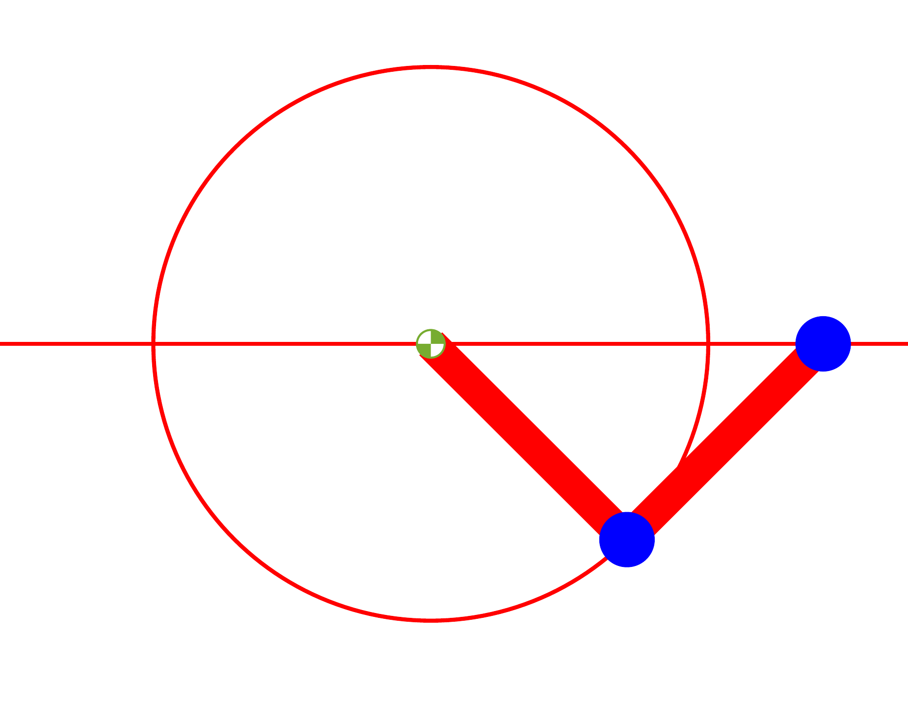
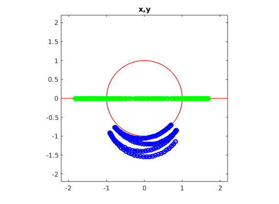

ODE solve example 7
===================

Load ODE
--------

Consider a crank-rod system described by the following DAE (14 equations):

.. math::

  \begin{cases}
    x_1' = u_1 & \\
    y_1' = v_1 & \\
    x_2' = u_2 & \\
    y_2' = v_2 & \\
    \theta' = \omega & \\
    m u_1' - \lambda_1 + \lambda_3 = 0 & \\
    m v_1' + mg-\lambda_2 = 0 & \\
    m u_2' - \lambda_3 = 0 & \\
    m v_2' + mg-\lambda_4 = 0 & \\
    -\lambda_1 L \sin(\theta)-\lambda_2 L \sin(\theta) = 0 & \\
    -\lambda_3 L \sin(\theta) = 0 & \\
    x_1 -  L \cos(\theta) = 0 & \\
    y_1 -  L \cos(\theta) = 0 & \\
    x_2 - x_1- L \cos(\theta) = 0 & \\
    y_2 = 0 &
  \end{cases}

MAPLE
-----

Load maple toolbox

.. code-block:: maple

    > read("{PATH}/DAE-toolbox.maplet");

Define ODE and constranints

.. code-block:: maple

    > EQ1  := diff(x__1(t),t)=u__1(t);
    > EQ2  := diff(y__1(t),t)=v__1(t);
    > EQ3  := diff(x__2(t),t)=u__2(t);
    > EQ4  := diff(y__2(t),t)=v__2(t);
    > EQ5  := diff(theta(t),t)=omega(t);
    > EQ6  := m*diff(u__1(t),t)-lambda__1(t)+lambda__3(t)=0;
    > EQ7  := m*diff(v__1(t),t)+mg-lambda__2(t)=0;
    > EQ8  := m*diff(u__2(t),t)-lambda__3(t)=0;
    > EQ9  := m*diff(v__2(t),t)+mg-lambda__4(t)=0;
    > ALG1 := x__1(t)-L*cos(theta(t))=0;
    > ALG2 := y__1(t)-L*sin(theta(t))=0;
    > ALG3 := x__2(t)-x__1(t)-L*cos(theta(t))=0;
    > ALG4 := y__2(t)=0;

Define variables (and differential of its)

.. code-block:: maple

    > VARS  := [x(t),y(t),u(t),v(t),lambda(t)];
    > DVARS := map(diff,VARS,t)

Use toolbox to separate differential and algebraic
part and build the matrix ``E`` for differetial part of the DAE.

.. code-block:: maple

    > E1, G1, A1, r := DAE_separate_algebraic_bis( [EQ||(1..4),ALG], DVARS );

Reduce by 1 the index

.. code-block:: maple

    > E2, G2, A2, r := DAE_reduce_index_by_1( E1, G1, A1, DVARS );

Reduce (again) by 1 the index

.. code-block:: maple

    > E3, G3, A3, r := DAE_reduce_index_by_1( E2, G2, A2, DVARS );

Reduce (one more) by 1 the index

.. code-block:: maple

    > E4, G4, A4, r := DAE_reduce_index_by_1( E3, G3, A3, DVARS );

Now is an ODE, 3 index reduction appllied,
original DAE of index 3.

.. code-block:: maple

    > RHS := collect(simplify(LinearSolve( E4, G4 )),[m,lambda]);

Build Jacobian of RHS of ODE:

.. code-block:: maple

    > JODE := map(simplify,JACOBIAN(RHS_ODE,VARS));

Build the map with the hidden constraints and its Jacobian:

.. code-block:: maple

    > A := <A1,A2,A3>;
    > JA := map(simplify,JACOBIAN(A,VARS));

If index is reduced, we obtain the following ODE:

.. math::

  \begin{cases}
    x_1'       = u_1 & \\
    y_1'       = v_1 & \\
    x_2'       = u_2 & \\
    y_2'       = v_2 & \\
    \theta'    = \omega & \\
    u_1'       = \dfrac{\lambda_1-\lambda_3}{m} & \\
    v_1'       = \dfrac{\lambda_2 - mg}{m} & \\
    u_2'       = \dfrac{\lambda_3}{m} & \\
    v_2'       = \dfrac{\lambda_4 - mg}{m}  & \\
    \omega'    = \dfrac{-L\omega^2\cos(\theta)m + \lambda_3 - \lambda_1}{L\sin(\theta)m} & \\
    \lambda_1' = 9\omega(L\cos(\theta)^4\omega^2m + (\lambda_1 - \lambda_3)\cos(\theta)^3 + L\omega^2\cos(\theta)^2\sin(\theta)^2m + (2\sin(\theta)^2(\lambda_1 - \dots & \\
    \qquad 2\lambda_3)\cos(\theta))/3 - \sin(\theta)^3\lambda_2/3)/(5\sin(\theta)^3 + \cos(\theta)^2\sin(\theta)) & \\
    \lambda_2' = \omega(15L\cos(\theta)^3\omega^2m + 15L\cos(\theta)\sin(\theta)^2\omega^2m - 14\cos(\theta)^2\lambda_3 + 16\cos(\theta)^2\lambda_1 + \dots & \\
    \qquad \cos(\theta)\sin(\theta)\lambda_2 - 15\sin(\theta)^2\lambda_3 + 15\sin(\theta)^2\lambda_1)/(\cos(\theta)^2 + 5\sin(\theta)^2) & \\
    \lambda_3' = 6\omega(L\cos(\theta)^4\omega^2m + (\lambda_1 - \lambda_3)\cos(\theta)^3 + L\omega^2\cos(\theta)^2\sin(\theta)^2m + \dots & \\
    \qquad (2\sin(\theta)^2(\lambda_1 - 2\lambda_3)\cos(\theta))/3 - \sin(\theta)^3\lambda_2/3)/(5\sin(\theta)^3 + \cos(\theta)^2\sin(\theta)) & \\
    \lambda_4' = 0 &
  \end{cases}

MATLAB Class definition
-----------------------

Define the class for the ODE to be integrated.
In this case the class ``CrankRod14EQ`` derived from
the base class ``DAC_ODEclass``.
The following is the contents of the file `CrankRod14EQ.m`

.. code-block:: matlab

      classdef CrankRod14EQ < DAC_ODEclass
      properties (SetAccess = protected, Hidden = true)
        ell;
        m;
        gravity;
      end
      methods
        function self = CrankRod14EQ( ell, m, gravity )
          neq  = 14;
          ninv = 12;
          self@DAC_ODEclass( 'CrankRod14EQ', neq, ninv );
          self.ell     = ell;
          self.m       = m;
          self.gravity = gravity;
        end
        % - - - - - - - - - - - - - - - - - - - - - - - - - - - - - - - - - - -
        function res__f = f( self, t, vars__ )
          % ...
        end
        % - - - - - - - - - - - - - - - - - - - - - - - - - - - - - - - - - - -
        function res__DfDx = DfDx( self, t, vars__ )
          % ...
        end
        % - - - - - - - - - - - - - - - - - - - - - - - - - - - - - - - - - - -
        function res__DfDt = DfDt( self, t, vars__ )
          % ...
        end
        % - - - - - - - - - - - - - - - - - - - - - - - - - - - - - - - - - - -
        function res__h = h( self, t, vars__ )
          % ...
        end
        % - - - - - - - - - - - - - - - - - - - - - - - - - - - - - - - - - - -
        function res__DhDx = DhDx( self, t, vars__ )
          % ...
        end
        % - - - - - - - - - - - - - - - - - - - - - - - - - - - - - - - - - - -
        function res__DhDt = DhDt( self, t, vars__ )
          % ...
        end
        % - - - - - - - - - - - - - - - - - - - - - - - - - - - - - - - - - - -
        function plot( self, t, Z )
          % ...
        end
      end
    end

To define the methods you need the MAPLE
substitution (make a function ``fun(x)`` as the symbol ``fun``)

.. code-block:: maple

    > REMOVE_T := map(x->x=op(0,x),VARS);

Method f(t,x)
~~~~~~~~~~~~~

Implementation of RHS of ODE.
Use maple command

.. code-block:: maple

    > F_TO_MATLAB( <subs(REMOVE_T,RHS)>, subs(REMOVE_T,VARS), "f");

The lines highlighted which remap model parameters
are not automatically generated.

.. code-block:: matlab
    :emphasize-lines: 2-4

    function res__f = f( self, t, vars__ )
      g = self.gravity;
      m = self.m;
      L = self.ell;

      % extract states
      x__1  = vars__(1);
      y__1  = vars__(2);
      x__2  = vars__(3);
      y__2  = vars__(4);
      theta = vars__(5);
      u__1  = vars__(6);
      v__1  = vars__(7);
      u__2  = vars__(8);
      v__2  = vars__(9);
      omega = vars__(10);
      lambda__1 = vars__(11);
      lambda__2 = vars__(12);
      lambda__3 = vars__(13);
      lambda__4 = vars__(14);

      % evaluate function
      res__1 = u__1;
      res__2 = v__1;
      res__3 = u__2;
      res__4 = v__2;
      res__5 = omega;
      t2 = 0.1e1 / m;
      res__6 = t2 * (lambda__1 - lambda__3);
      t3 = m * g;
      res__7 = t2 * (-t3 + lambda__2);
      res__8 = lambda__3 * t2;
      res__9 = t2 * (-t3 + lambda__4);
      t6 = omega ^ 2;
      t7 = cos(theta);
      t10 = L * m * t7 * t6;
      t14 = sin(theta);
      t15 = 0.1e1 / t14;
      res__10 = t2 * t15 / L * (-t10 - lambda__1 + lambda__3);
      t18 = t7 ^ 2;
      t24 = t18 * t7;
      t36 = 0.1e1 / (4 * t18 - 5);
      t38 = t15 * t36 * (3 * m * t18 * L * t6 + lambda__2 * t14 * t18 - lambda__2 * t14 + lambda__1 * t24 + lambda__3 * t24 + 2 * lambda__1 * t7 - 4 * lambda__3 * t7) * omega;
      res__11 = -3 * t38;
      res__12 = -t36 * (lambda__2 * t14 * t7 + lambda__1 * t18 + lambda__3 * t18 + 15 * t10 + 15 * lambda__1 - 15 * lambda__3) * omega;
      res__13 = -2 * t38;

      % store on output
      res__f = zeros(14,1);
      res__f(1) = res__1;
      res__f(2) = res__2;
      res__f(3) = res__3;
      res__f(4) = res__4;
      res__f(5) = res__5;
      res__f(6) = res__6;
      res__f(7) = res__7;
      res__f(8) = res__8;
      res__f(9) = res__9;
      res__f(10) = res__10;
      res__f(11) = res__11;
      res__f(12) = res__12;
      res__f(13) = res__13;
    end

Method DfDx(t,x)
~~~~~~~~~~~~~~~~

Implementation of RHS of ODE.
Use maple command

.. code-block:: maple

    > JF_TO_MATLAB( <subs(REMOVE_T,RHS)>, subs(REMOVE_T,VARS), "DfDx");

The lines highlighted which remap model parameters
are not automatically generated.

.. code-block:: matlab
    :emphasize-lines: 2-4

    function res__DfDx = DfDx( self, t, vars__ )
      g = self.gravity;
      m = self.m;
      L = self.ell;

      % extract states
      x__1  = vars__(1);
      y__1  = vars__(2);
      x__2  = vars__(3);
      y__2  = vars__(4);
      theta = vars__(5);
      u__1  = vars__(6);
      v__1  = vars__(7);
      u__2  = vars__(8);
      v__2  = vars__(9);
      omega = vars__(10);
      lambda__1 = vars__(11);
      lambda__2 = vars__(12);
      lambda__3 = vars__(13);
      lambda__4 = vars__(14);
      % evaluate function
      res__1_1 = u__1;
      res__2_1 = v__1;
      res__3_1 = u__2;
      res__4_1 = v__2;
      res__5_1 = omega;
      t2 = 0.1e1 / m;
      res__6_1 = t2 * (lambda__1 - lambda__3);
      t3 = m * g;
      res__7_1 = t2 * (-t3 + lambda__2);
      res__8_1 = lambda__3 * t2;
      res__9_1 = t2 * (-t3 + lambda__4);
      t6 = omega ^ 2;
      t7 = cos(theta);
      t10 = L * m * t7 * t6;
      t14 = sin(theta);
      t15 = 0.1e1 / t14;
      res__10_1 = t2 * t15 / L * (-t10 - lambda__1 + lambda__3);
      t18 = t7 ^ 2;
      t24 = t18 * t7;
      t36 = 0.1e1 / (4 * t18 - 5);
      t38 = t15 * t36 * (3 * m * t18 * L * t6 + lambda__2 * t14 * t18 - lambda__2 * t14 + lambda__1 * t24 + lambda__3 * t24 + 2 * lambda__1 * t7 - 4 * lambda__3 * t7) * omega;
      res__11_1 = -3 * t38;
      res__12_1 = -t36 * (lambda__2 * t14 * t7 + lambda__1 * t18 + lambda__3 * t18 + 15 * t10 + 15 * lambda__1 - 15 * lambda__3) * omega;
      res__13_1 = -2 * t38;

      % store on output
      res__DfDx       = zeros(14,1);
      res__DfDx(1,1)  = res__1_1;
      res__DfDx(2,1)  = res__2_1;
      res__DfDx(3,1)  = res__3_1;
      res__DfDx(4,1)  = res__4_1;
      res__DfDx(5,1)  = res__5_1;
      res__DfDx(6,1)  = res__6_1;
      res__DfDx(7,1)  = res__7_1;
      res__DfDx(8,1)  = res__8_1;
      res__DfDx(9,1)  = res__9_1;
      res__DfDx(10,1) = res__10_1;
      res__DfDx(11,1) = res__11_1;
      res__DfDx(12,1) = res__12_1;
      res__DfDx(13,1) = res__13_1;
    end

Method DfDt(t,x)
~~~~~~~~~~~~~~~~

Implementation of RHS of ODE.
Use maple command

.. code-block:: maple

    > JF_TO_MATLAB( JACOBIAN(<subs(REMOVE_T,RHS)>, [t]), [t], "DfDt");

The lines highlighted which remap model parameters
are not automatically generated.

.. code-block:: matlab

    function res__DfDt = DfDt( self, t, vars__ )  
      % store on output
      res__DfDt = zeros(14,1);
    end

Method h(t,x)
~~~~~~~~~~~~~

Implementation of hidden constraints:
Use maple command

.. code-block:: maple

    > F_TO_MATLAB( subs(REMOVE_T,A), subs(REMOVE_T,VARS), "h");

The lines highlighted which remap model parameters
are not automatically generated.

.. code-block:: matlab
    :emphasize-lines: 2-4

    function res__h = h( self, t, vars__ )
      g = self.gravity;
      m = self.m;
      L = self.ell;

      % extract states
      x__1  = vars__(1);
      y__1  = vars__(2);
      x__2  = vars__(3);
      y__2  = vars__(4);
      theta = vars__(5);
      u__1  = vars__(6);
      v__1  = vars__(7);
      u__2  = vars__(8);
      v__2  = vars__(9);
      omega = vars__(10);
      lambda__1 = vars__(11);
      lambda__2 = vars__(12);
      lambda__3 = vars__(13);
      lambda__4 = vars__(14);

      % evaluate function
      t2 = sin(theta);
      t4 = cos(theta);
      res__1 = (t2 * (lambda__1 + lambda__3) - lambda__2 * t4) * L;
      t7 = t4 * L;
      res__2 = -x__1 + t7;
      res__3 = t2 * L - y__1;
      res__4 = -x__2 + x__1 + t7;
      res__5 = -y__2;
      t9 = L * omega;
      t10 = t2 * t9;
      res__6 = u__1 + t10;
      res__7 = -t4 * t9 + v__1;
      res__8 = u__2 - u__1 + t10;
      res__9 = v__2;
      t12 = m * g;
      t17 = omega ^ 2;
      t23 = 0.1e1 / m;
      res__10 = t23 / t2 * (t2 * (t12 - lambda__2) + t4 * (lambda__3 - lambda__1) - m * t17 * L);
      res__11 = t23 * (2 * lambda__1 - 3 * lambda__3);
      res__12 = t23 * (t12 - lambda__4);

      % store on output
      res__h     = zeros(12,1);
      res__h(1)  = res__1;
      res__h(2)  = res__2;
      res__h(3)  = res__3;
      res__h(4)  = res__4;
      res__h(5)  = res__5;
      res__h(6)  = res__6;
      res__h(7)  = res__7;
      res__h(8)  = res__8;
      res__h(9)  = res__9;
      res__h(10) = res__10;
      res__h(11) = res__11;
      res__h(12) = res__12;
    end

Method DhDx(t,x)
~~~~~~~~~~~~~~~~

Implementation of jacobian of hidden constraints:
Use maple command

.. code-block:: maple

    > JF_TO_MATLAB( subs(REMOVE_T,JA), subs(REMOVE_T,VARS), "DhDx");

The lines highlighted which remap model parameters
are not automatically generated.

.. code-block:: matlab
    :emphasize-lines: 2-4

    function res__DhDx = DhDx( self, t, vars__ )
      g = self.gravity;
      m = self.m;
      L = self.ell;

      % extract states
      x__1 = vars__(1);
      y__1 = vars__(2);
      x__2 = vars__(3);
      y__2 = vars__(4);
      theta = vars__(5);
      u__1 = vars__(6);
      v__1 = vars__(7);
      u__2 = vars__(8);
      v__2 = vars__(9);
      omega = vars__(10);
      lambda__1 = vars__(11);
      lambda__2 = vars__(12);
      lambda__3 = vars__(13);
      lambda__4 = vars__(14);

      % evaluate function
      t2 = cos(theta);
      t4 = sin(theta);
      res__1_5 = (t2 * (lambda__1 + lambda__3) + lambda__2 * t4) * L;
      res__1_11 = t4 * L;
      t7 = t2 * L;
      res__1_12 = -t7;
      res__1_13 = res__1_11;
      res__2_1 = -1;
      res__2_5 = -res__1_13;
      res__3_2 = -1;
      res__3_5 = t7;
      res__4_1 = 1;
      res__4_3 = -1;
      res__4_5 = res__2_5;
      res__5_4 = -1;
      t8 = L * omega;
      res__6_5 = t2 * t8;
      res__6_6 = 1;
      res__6_10 = res__1_13;
      res__7_5 = t4 * t8;
      res__7_7 = 1;
      res__7_10 = res__1_12;
      res__8_5 = res__6_5;
      res__8_6 = -1;
      res__8_8 = 1;
      res__8_10 = res__6_10;
      res__9_9 = 1;
      t9 = omega ^ 2;
      t14 = t4 ^ 2;
      t17 = 0.1e1 / m;
      res__10_5 = t17 / t14 * (L * m * t2 * t9 + lambda__1 - lambda__3);
      t18 = 0.1e1 / t4;
      res__10_10 = -2 * t18 * t8;
      t22 = t17 * t18 * t2;
      res__10_11 = -t22;
      res__10_12 = -t17;
      res__10_13 = t22;
      res__11_11 = 2 * t17;
      res__11_13 = -3 * t17;
      res__12_14 = res__10_12;

      % store on output
      res__DhDx = zeros(12,14);
      res__DhDx(1,5) = res__1_5;
      res__DhDx(1,11) = res__1_11;
      res__DhDx(1,12) = res__1_12;
      res__DhDx(1,13) = res__1_13;
      res__DhDx(2,1) = res__2_1;
      res__DhDx(2,5) = res__2_5;
      res__DhDx(3,2) = res__3_2;
      res__DhDx(3,5) = res__3_5;
      res__DhDx(4,1) = res__4_1;
      res__DhDx(4,3) = res__4_3;
      res__DhDx(4,5) = res__4_5;
      res__DhDx(5,4) = res__5_4;
      res__DhDx(6,5) = res__6_5;
      res__DhDx(6,6) = res__6_6;
      res__DhDx(6,10) = res__6_10;
      res__DhDx(7,5) = res__7_5;
      res__DhDx(7,7) = res__7_7;
      res__DhDx(7,10) = res__7_10;
      res__DhDx(8,5) = res__8_5;
      res__DhDx(8,6) = res__8_6;
      res__DhDx(8,8) = res__8_8;
      res__DhDx(8,10) = res__8_10;
      res__DhDx(9,9) = res__9_9;
      res__DhDx(10,5) = res__10_5;
      res__DhDx(10,10) = res__10_10;
      res__DhDx(10,11) = res__10_11;
      res__DhDx(10,12) = res__10_12;
      res__DhDx(10,13) = res__10_13;
      res__DhDx(11,11) = res__11_11;
      res__DhDx(11,13) = res__11_13;
      res__DhDx(12,14) = res__12_14;
    end

Method DhDt(t,x)
~~~~~~~~~~~~~~~~

Implementation of RHS of ODE.
Use maple command

.. code-block:: maple

    > JF_TO_MATLAB( JACOBIAN(<subs(REMOVE_T,A)>, [t]), [t], "DhDt");

The lines highlighted which remap model parameters
are not automatically generated.

.. code-block:: matlab

    function res__DhDt = DhDt( self, t, vars__ )
      % store on output
      res__DhDt = zeros(12,1);
    end

Method plot(t,x)
~~~~~~~~~~~~~~~~

Plotting the mechanism:

.. code-block:: matlab

    function CrankRod14EQPlot( t, x1, y1, x2, y2, ell )
      x_0 = 0;
      y_0 = 0;
      xc1 = ell*cos(0:pi/100:2*pi);
      yc1 = ell*sin(0:pi/100:2*pi);
      hold off;
      plot( xc1, yc1, '-r', 'Linewidth', 1 );
      hold on;
      axis_lim = ell*2.5;
      xc2 = -axis_lim:0.05:axis_lim;
      yc2 = 0.0*(-axis_lim:0.05:axis_lim);
      plot( xc2, yc2, '-r', 'Linewidth', 1 );
      axis equal;
      drawLine( x_0, y_0, x1, y1, 'LineWidth', 8, 'Color', 'r' );
      drawLine( x1, y1, x2, y2, 'LineWidth', 8, 'Color', 'r' );
      drawCOG(0.1*ell,x_0,y_0);
      fillCircle( 'b', x1, y1, 0.1*ell );
      fillCircle( 'b', x2, y2, 0.1*ell );
      xlim([ -axis_lim axis_lim ]);
      ylim([ -axis_lim axis_lim ]);
      title(sprintf('time=%5.2g',t));
    end

MATLAB usage in script
----------------------

Instantiate the ODE
~~~~~~~~~~~~~~~~~~~

Having `CrankRod14EQ.m` now can instantiate the ODE

.. code-block:: matlab

  % load the crank and rod model in the variable ode
  ell     = 1.0;
  m       = 1.0;
  gravity = 9.81;
  ode     = CrankRod14EQ( ell, m, gravity );

Choose solver
~~~~~~~~~~~~~

Choose `ExplicitEuler` as solver and attach the
instantiated ode to it.

.. code-block:: matlab

  solver = ExplicitEuler(); % initialize solver
  solver.setODE(ode);       % Attach ode to the solver

Integrate
~~~~~~~~~

Select the range and the sampling point for the numerical solution

.. code-block:: matlab

  Tmax = 7.5;
  h    = 0.05;
  tt   = 0:h:Tmax;

setup initial condition, use hidden constraint

.. math::

  \begin{cases}
    -\lambda_1L\sin(\theta) + \lambda_2L\cos(\theta) - \lambda_3L\sin(\theta) = 0 & \\
    x_1 - L\cos(\theta) = 0 & \\
    y_1 - L\sin(\theta) = 0 & \\
    x_2 - x_1 - L\cos(\theta) = 0 & \\
    y_2 = 0 & \\
    u_1 + L\omega\sin(\theta) = 0 & \\
    v_1 - L\omega\cos(\theta) = 0 & \\
    u_2 - u_1 + L\omega\sin(\theta) = 0 & \\
    v_2 = 0 & \\
    (-gm + \lambda_2)/m + (\omega^2\cos(\theta)Lm + \lambda_1 - \lambda_3)\cos(\theta)/(\sin(\theta)m) + L\omega^2\sin(\theta) = 0 & \\
    \lambda_3/m + (\lambda_3 - \lambda_1)/m - (\omega^2\cos(\theta)Lm + \lambda_1 - \lambda_3)/m + \omega^2\cos(\theta)L = 0 & \\
    (-gm + \lambda_4)/m = 0 &
  \end{cases}

to set consistent initial conditions

.. code-block:: matlab

  angle     = -pi/4;
  speed     = 0.0;
  x_10      = ell*cos(angle);
  y_10      = ell*sin(angle);
  x_20      = 2*ell*cos(angle);
  y_20      = 0;
  theta_0   = angle;
  u_10      = -speed*ell*sin(angle);
  v_10      = speed*ell*cos(angle);
  u_20      = -2*speed*ell*sin(angle);
  v_20      = 0;
  lambda_10 = -3*m*cos(angle)*(ell*(speed^2)-gravity*sin(angle))*(1/(4*sin(angle)^2+1));
  lambda_20 = -5*m*sin(angle)*(ell*(speed^2)-gravity*sin(angle))*(1/(4*sin(angle)^2+1));
  lambda_30 = -2*m*cos(angle)*(ell*(speed^2)-gravity*sin(angle))*(1/(4*sin(angle)^2+1));
  lambda_40 = m*gravity;
  ini       = [ x_10; y_10; x_20; y_20; theta_0; ...
                u_10; v_10; u_20; v_20; ...
                lambda_10; lambda_20; lambda_30; lambda_40; ];

compute numerical solution

.. code-block:: matlab

  sol = solver.advance( tt, ini );

now the matrix ``sol`` contain the solution.
The first column contain \(\theta\) the second column
contains  \(\omega\).

Extract solution
~~~~~~~~~~~~~~~~

.. code-block:: matlab

  x_1   = sol(1,:);
  y_1   = sol(2,:);
  x_2   = sol(3,:);
  y_2   = sol(4,:);

Plot the solution
~~~~~~~~~~~~~~~~~

.. code-block:: matlab

  % sample a circle and plot (the constraint)
  xc1 = ell*cos(0:pi/100:2*pi);
  yc1 = ell*sin(0:pi/100:2*pi);
  plot( xc1, yc1, '-r', 'Linewidth', 1 );
  hold on
  axis_lim = ell*2.2;
  xc2 = -axis_lim:0.05:axis_lim;
  yc2 = 0.0*(-axis_lim:0.05:axis_lim);
  plot( xc2, yc2, '-r', 'Linewidth', 1 );
  axis equal
  plot( x_1, y_1, '-o', 'MarkerSize', 6, 'Linewidth', 2, 'Color', 'blue' );
  plot( x_2, y_2, '-o', 'MarkerSize', 6, 'Linewidth', 2, 'Color', 'green' );
  xlim([-axis_lim axis_lim])
  ylim([-axis_lim axis_lim])
  title('x,y');

.. code-block:: matlab

  ode.animate_plot( tt, sol, 10, 1 );

.. image:: ./images/Manual_ODE_TEST7_mov1.mp4
   :width: 90%
   :align: center
