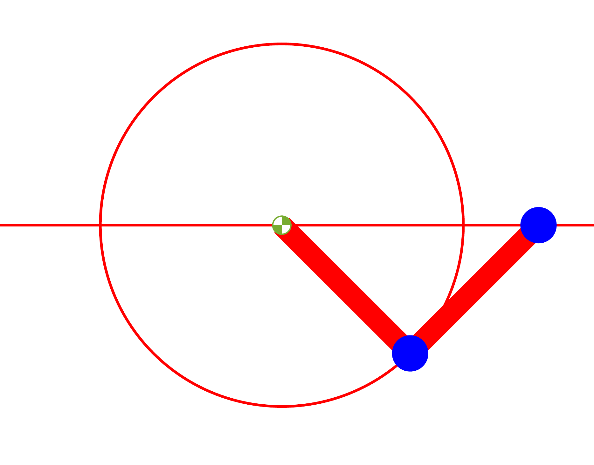

ODE solve example 8
===================

Load ODE
--------

Consider a crank-rod system described by the following DAE (17 equations):

.. math::

  \begin{cases}
    x_1' = u_1 & \\
    y_1' = v_1 & \\
    x_2' = u_2 & \\
    y_2' = v_2 & \\
    \theta_1' = \omega_1 & \\
    \theta_2' = \omega_2 & \\
    m u_1' - \lambda_1 + \lambda_3 = 0 & \\
    m v_1' + mg-\lambda_2 = 0 & \\
    m u_2' - \lambda_3 = 0 & \\
    m v_2' + mg-\lambda_4 = 0 & \\
    -\lambda_1 L \sin(\theta)-\lambda_2 L \sin(\theta) = 0 & \\
    -\lambda_3 L \sin(\theta) = 0 & \\
    x_1 -  L \cos(\theta) = 0 & \\
    y_1 -  L \cos(\theta) = 0 & \\
    x_2 - x_1- L \cos(\theta) = 0 & \\
    y_2 = 0 &
  \end{cases}

If index is reduced, we obtain the ODE:

.. math::

  \begin{cases}
    x_1'       = u_1 & \\
    y_1'       = v_1 & \\
    x_2'       = u_2 & \\
    y_2'       = v_2 & \\
    \theta_1'  = \omega_1 & \\
    \theta_2'  = \omega_2 & \\
    u_1'       = \dfrac{\lambda_1-\lambda_3}{m} & \\
    v_1'       = \dfrac{\lambda_2 - mg}{m} & \\
    u_2'       = \dfrac{\lambda_3}{m} & \\
    v_2'       = \dfrac{\lambda_4 - mg}{m}  & \\
    \omega_1'  = \dfrac{-L\omega_1^2\cos(\theta_1)m + \lambda_3 - \lambda_1}{L\sin(\theta_1)m} & \\
    \omega_2'  = \dfrac{-L\omega_2^2\cos(\theta_2)m - 2\lambda_3 + \lambda_1}{L\sin(\theta_2)m} & \\
    \lambda_1' = ((((-\lambda_5 + \lambda_2)\omega_1 + 2\lambda_5\omega_2)\cos(\theta_2)^3 - 2\sin(\theta_2)(\lambda_3\omega_2 + \dots & \\
    \qquad \lambda_1\omega_1)\cos(\theta_2)^2 + (-3L\omega_2^3\sin(\theta_2)m + (\lambda_5 - \lambda_2)\omega_1 - 2\lambda_5\omega_2)\cos(\theta_2) - \dots & \\
    \qquad 6(\lambda_3 - \lambda_1/2)\omega_2\sin(\theta_2))\cos(\theta_1)^3 + (-\sin(\theta_1)(\lambda_3\omega_2 + \lambda_1\omega_1)\cos(\theta_2)^3 + \dots & \\
    \qquad ((((2\lambda_5 - 2\lambda_2)\omega_1 - \lambda_5\omega_2)\sin(\theta_1) - 3Lm\omega_1^3)\sin(\theta_2) - 3L\omega_2^3m\sin(\theta_1))\cos(\theta_2)^2 - \dots & \\
    \qquad 5(-\lambda_1\omega_1/5 + \omega_2(\lambda_3 - (3\lambda_1)/5))\sin(\theta_1)\cos(\theta_2) - 3(Lm\omega_1^3 - \lambda_5\sin(\theta_1)\omega_2/3) \dots & \\
    \qquad \sin(\theta_2))\cos(\theta_1)^2 + (((\lambda_5 - \lambda_2)\omega_1 - 2\lambda_5\omega_2)\cos(\theta_2)^3 + 3((\lambda_3 - \lambda_1/3)\omega_1 + \dots & \\
    \qquad (2\lambda_3\omega_2)/3)\sin(\theta_2)\cos(\theta_2)^2 + (3L\omega_2^3\sin(\theta_2)m + (-\lambda_5 + \lambda_2)\omega_1 + 2\lambda_5\omega_2)\cos(\theta_2) + \dots & \\
    \qquad 3((\lambda_3 - \lambda_1)\omega_1 + 2(\lambda_3 - \lambda_1/2)\omega_2)\sin(\theta_2))\cos(\theta_1) - 2\cos(\theta_2)^2\sin(\theta_1)\sin(\theta_2)\omega_1(\lambda_5 - \dots & \\
    \qquad \lambda_2))/(2\sin(\theta_1)((\cos(\theta_2)^2 - 1/2)\cos(\theta_1)^2 - \cos(\theta_1)\cos(\theta_2)\sin(\theta_1)\sin(\theta_2) - \cos(\theta_2)^2)\sin(\theta_2)) & \\
    \lambda_2' = (3\cos(\theta_2)((-((\lambda_5 - \lambda_2)\omega_1\sin(\theta_2))/3 + Lm\omega_2^3)\cos(\theta_2) + 2(\lambda_3 - \lambda_1/2)\omega_2)\cos(\theta_1)^3 + \dots & \\
    \qquad ((3Lm\omega_1^3 + \lambda_5\sin(\theta_1)\omega_2)\cos(\theta_2)^3 - \sin(\theta_1)\sin(\theta_2)(\lambda_3\omega_2 + \lambda_1\omega_1)\cos(\theta_2)^2 + \dots & \\
    \qquad (-3L\sin(\theta_1)\sin(\theta_2)m\omega_2^3 - 3Lm\omega_1^3 - \lambda_5\sin(\theta_1)\omega_2)\cos(\theta_2) - 6(\lambda_3 - \lambda_1/2) \dots & \\
    \qquad \sin(\theta_1)\omega_2\sin(\theta_2))\cos(\theta_1)^2 - 6\cos(\theta_2)(((\lambda_3 - \lambda_1)\omega_1\cos(\theta_2)^2)/2 + (\omega_1(L\sin(\theta_1)m\omega_1^2 - \dots & \\
    \qquad \lambda_5/6 + \lambda_2/6)\sin(\theta_2) + Lm\omega_2^3/2)\cos(\theta_2) + (-\lambda_3/2 + \lambda_1/2)\omega_1 + (\lambda_3 - \lambda_1/2)\omega_2)\cos(\theta_1) + \dots & \\
    \qquad 6\cos(\theta_2)^2\sin(\theta_1)\sin(\theta_2)\omega_1(\lambda_3 - \lambda_1))/(2\sin(\theta_1)((\cos(\theta_2)^2 - 1/2)\cos(\theta_1)^2 - \dots & \\
    \qquad \cos(\theta_1)\cos(\theta_2)\sin(\theta_1)\sin(\theta_2) - \cos(\theta_2)^2)\sin(\theta_2)) & \\
    \lambda_3' = ((((-\lambda_5 + \lambda_2)\omega_1 + \lambda_5\omega_2)\cos(\theta_1)^3 - \sin(\theta_1)(\lambda_3\omega_2 + \lambda_1\omega_1)\cos(\theta_1)^2 + \dots & \\
    \qquad (-3L\omega_1^3\sin(\theta_1)m + (\lambda_5 - \lambda_2)\omega_1 - \lambda_5\omega_2)\cos(\theta_1) + 3\sin(\theta_1)\omega_1(\lambda_3 - \lambda_1))\cos(\theta_2)^3 + \dots & \\
    \qquad (-\sin(\theta_2)(\lambda_3\omega_2 + \lambda_1\omega_1)\cos(\theta_1)^3 - 3\sin(\theta_2)(((-\lambda_5/3 + \lambda_2/3)\omega_1 + \lambda_5\omega_2/3)\sin(\theta_1) + \dots & \\
    \qquad Lm\omega_1^3)\cos(\theta_1)^2 + 3((\lambda_3 - (2\lambda_1)/3)\omega_1 + \lambda_3\omega_2/3)\sin(\theta_2)\cos(\theta_1) - 3(((\lambda_5 - \lambda_2)\omega_1\sin(\theta_2))/3 + \dots & \\
    \qquad Lm\omega_2^3)\sin(\theta_1))\cos(\theta_2)^2 + (((\lambda_5 - \lambda_2)\omega_1 - \lambda_5\omega_2)\cos(\theta_1)^3 + \sin(\theta_1)(\lambda_3\omega_2 + \lambda_1\omega_1) \dots & \\
    \qquad \cos(\theta_1)^2 + (3L\omega_1^3\sin(\theta_1)m + (-\lambda_5 + \lambda_2)\omega_1 + \lambda_5\omega_2)\cos(\theta_1) - 3\sin(\theta_1)((\lambda_3 - \lambda_1)\omega_1 + \dots & \\
    \qquad 2(\lambda_3 - \lambda_1/2)\omega_2))\cos(\theta_2) + \cos(\theta_1)^2\sin(\theta_1)\sin(\theta_2)\lambda_5\omega_2)/(2\sin(\theta_1)((\cos(\theta_1)^2 - 1)\cos(\theta_2)^2 - \dots & \\
    \qquad \cos(\theta_1)\cos(\theta_2)\sin(\theta_1)\sin(\theta_2) - \cos(\theta_1)^2/2)\sin(\theta_2)) & \\
    \lambda_4' = 0 & \\
    \lambda_5' = ((((-\lambda_5 + \lambda_2)\omega_1 - \lambda_5\omega_2)\cos(\theta_2)^2 + \sin(\theta_2)(\lambda_3\omega_2 -  \dots & \\
    \qquad \lambda_1\omega_1)\cos(\theta_2) + (\lambda_5 - \lambda_2)\omega_1 + \lambda_5\omega_2)\cos(\theta_1)^3 + (\sin(\theta_1)(\lambda_3\omega_2 - \dots & \\
    \qquad \lambda_1\omega_1)\cos(\theta_2)^2 - 3\sin(\theta_2)(((-\lambda_5/3 + \lambda_2/3)\omega_1 - \lambda_5\omega_2/3)\sin(\theta_1) + \dots & \\
    \qquad Lm\omega_1^3)\cos(\theta_2) + \lambda_1\omega_1\sin(\theta_1))\cos(\theta_1)^2 + ((-3L\omega_1^3\sin(\theta_1)m + (\lambda_5 - \dots & \\
    \qquad \lambda_2)\omega_1 + \lambda_5\omega_2)\cos(\theta_2)^2 + 3((\lambda_3 - (2\lambda_1)/3)\omega_1 - \lambda_3\omega_2/3)\sin(\theta_2)\cos(\theta_2) + \dots & \\
    \qquad 3L\omega_1^3\sin(\theta_1)m + (-\lambda_5 + \lambda_2)\omega_1 - \lambda_5\omega_2)\cos(\theta_1) - 3\sin(\theta_1)(((\lambda_1 - \lambda_3)\omega_1 + \dots & \\
    \qquad (2\lambda_3\omega_2)/3)\cos(\theta_2)^2 + (((\lambda_5/3 - \lambda_2/3)\omega_1 + (2\lambda_5\omega_2)/3)\sin(\theta_2) + Lm\omega_2^3)\cos(\theta_2) + \dots & \\
    \qquad (\lambda_3 - \lambda_1)\omega_1 + 2(\lambda_3 - \lambda_1/2)\omega_2))/((2\cos(\theta_2)^2\sin(\theta_1) - \sin(\theta_1))\cos(\theta_1)^2 - \dots & \\
    \qquad 2\sin(\theta_1)^2\cos(\theta_2)\sin(\theta_2)\cos(\theta_1) - 2\cos(\theta_2)^2\sin(\theta_1)) &
  \end{cases}

Define the class for the ODE to be integrated.
In this case the class ``CrankRod17EQ`` derived from
the base class ``DAC_ODEclass``.
The following is the contents of the file `CrankRod14EQ.m`

..
  :emphasize-lines: 18, 19, 20, 21, 80, 81, 82, 83, 146, 147, 148, 149, 203, 205, 206

.. code:: matlab

  classdef CrankRod17EQ < DAC_ODEclass
    properties (SetAccess = protected, Hidden = true)
      ell;
      m;
      gravity;
    end
    methods
      function self = CrankRod17EQ( ell, m, gravity )
        neq  = 17;
        ninv = 15;
        self@DAC_ODEclass( 'CrankRod17EQ', neq, ninv );
        self.ell     = ell;
        self.m       = m;
        self.gravity = gravity;
      end
      % - - - - - - - - - - - - - - - - - - - - - - - - - - - - - - - - - - -
      function res__f = f( self, t, vars__ )
        % extract parameters
        g = self.gravity;
        m = self.m;
        L = self.ell;
        % extract states
        x__1      = vars__(1);
        y__1      = vars__(2);
        x__2      = vars__(3);
        y__2      = vars__(4);
        theta__1  = vars__(5);
        theta__2  = vars__(6);
        u__1      = vars__(7);
        v__1      = vars__(8);
        u__2      = vars__(9);
        v__2      = vars__(10);
        omega__1  = vars__(11);
        omega__2  = vars__(12);
        lambda__1 = vars__(13);
        lambda__2 = vars__(14);
        lambda__3 = vars__(15);
        lambda__4 = vars__(16);
        lambda__5 = vars__(17);
        % evaluate function
        res__1 = u__1;
        res__2 = v__1;
        res__3 = u__2;
        res__4 = v__2;
        res__5 = omega__1;
        res__6 = omega__2;
        t1 = lambda__1 - lambda__3;
        t2 = 0.1e1 / m;
        res__7 = t2 * t1;
        t3 = m * g;
        res__8 = t2 * (-t3 + lambda__2);
        res__9 = lambda__3 * t2;
        res__10 = t2 * (-t3 + lambda__4);
        t6 = omega__1 ^ 2;
        t7 = cos(theta__1);
        t9 = L * m;
        t12 = 0.1e1 / L;
        t14 = sin(theta__1);
        t15 = 0.1e1 / t14;
        res__11 = t2 * t15 * t12 * (-t9 * t7 * t6 - lambda__1 + lambda__3);
        t17 = omega__2 ^ 2;
        t18 = cos(theta__2);
        t21 = 2 * lambda__3;
        t24 = sin(theta__2);
        t25 = 0.1e1 / t24;
        res__12 = t2 * t25 * t12 * (-t9 * t18 * t17 - t21 + lambda__1);
        t27 = lambda__2 - lambda__5;
        t28 = omega__1 * t27;
        t29 = lambda__5 * omega__2;
        t30 = 2 * t29;
        t32 = t18 ^ 2;
        t33 = t32 * t18;
        t35 = lambda__1 * omega__1;
        t36 = lambda__3 * omega__2;
        t37 = t35 + t36;
        t39 = t32 * t37 * t24;
        t42 = t17 * omega__2;
        t45 = 3 * t42 * m * t24 * L;
        t46 = -t27;
        t47 = omega__1 * t46;
        t51 = -t21 + lambda__1;
        t53 = 3 * t51 * omega__2 * t24;
        t55 = t7 ^ 2;
        t56 = t55 * t7;
        t60 = 2 * t46;
        t64 = t6 * omega__1;
        t65 = t64 * t9;
        t66 = 3 * t65;
        t70 = t14 * t42 * t9;
        t91 = 3 * lambda__3;
        t94 = 2 * t36;
        t100 = omega__1 * t1;
        t101 = omega__2 * t51;
        t108 = t24 * t47;
        t116 = t24 * t14;
        t117 = t116 * t18 * t7;
        res__13 = t25 / (t55 * (t32 - 0.1e1 / 0.2e1) - t117 - t32) * t15 * (t56 * (t33 * (t28 + t30) - 2 * t39 + t18 * (-t45 + t47 - t30) + t53) + t55 * (-t33 * t37 * t14 + t32 * (t24 * (t14 * (omega__1 * t60 - t29) - t66) - 3 * t70) + t18 * t14 * (t35 + 3 * omega__2 * (lambda__1 - 0.5e1 / 0.3e1 * lambda__3)) - 3 * t24 * (t65 - omega__2 * t14 * lambda__5 / 3)) + t7 * (t33 * (t47 - t30) - t32 * (omega__1 * (lambda__1 - t91) - t94) * t24 + t18 * (t45 + t28 + t30) - 3 * t24 * (t100 + t101)) - 2 * t108 * t14 * t32) / 2;
        t127 = t55 ^ 2;
        t137 = t18 * (2 * t24 * omega__1 * (t14 * t27 / 6 + t6 * t9) + t70);
        t144 = t14 * L;
        t147 = 3 * t64 * m * t144;
        t179 = 0.1e1 / (t55 - 1);
        t185 = 0.1e1 / (2 * t32 * t55 - 2 * t117 - 2 * t32 - t55);
        t186 = t185 * t179;
        res__14 = t186 * t25 * (t127 * (omega__2 * t33 * lambda__5 - t39 + t18 * (-t45 - t29) + t53) - 3 * t56 * t18 * (-t51 * omega__2 * t14 + t137) + t55 * (t33 * (-t147 - t29) - 5 * t32 * (-t36 / 5 + omega__1 * (lambda__1 - 0.6e1 / 0.5e1 * lambda__3)) * t24 + t18 * (t147 + t45 + t29) - t53) + 3 * t7 * t18 * (-t32 * t1 * omega__1 * t14 + t137 + (-omega__2 * t51 + t100) * t14) + 6 * t100 * t24 * t32);
        t187 = t7 - 1;
        t188 = t7 + 1;
        t189 = t188 * t187;
        t191 = t55 * t37 / 3;
        t198 = t7 * (t14 * (omega__1 * t27 / 3 + t29 / 3) + t65);
        t211 = 3 * t64 * m * t24 * t144;
        t213 = -omega__1 * t60;
        t217 = 3 * t42 * t9;
        t222 = (lambda__1 - 0.3e1 / 0.2e1 * lambda__3) * omega__1;
        t223 = t36 / 2;
        res__15 = t186 * t25 * (-3 * t33 * (t191 + t198 + t100) * t189 + t32 * (t127 * (t47 - t29) * t24 + t56 * t37 * t116 + t55 * (t211 + t24 * (t213 + t29) - t217) + 2 * t7 * (t222 - t223) * t116 + t108 + t217) + 3 * t18 * (t191 + t198 + t100 + t101) * t189 + t188 * t187 * t24 * lambda__5 * omega__2 * t55);
        t241 = -t35 + t36;
        t243 = t47 + t29;
        t248 = t14 * t243;
        t255 = t14 * (t28 - t29);
        t259 = t91 - 2 * lambda__1;
        t271 = 3 * t101;
        t283 = 3 * t1;
        res__17 = t179 * t185 * (t127 * (t18 * t243 * t24 + t32 * t241 + t35) + t56 * (t32 * (t248 - t66) - t18 * t241 * t116 + t255 + t66) + t55 * (t32 * (omega__1 * t259 - 3 * t36) + t18 * (t211 + t24 * (t213 - 3 * t29) - t217) - omega__1 * t259 + t271) + t7 * (t32 * (t255 + t66) + 2 * t18 * t24 * (t222 + t223) * t14 + t248 - t66) + t32 * (omega__1 * t283 + t94) + t18 * (t24 * (t47 + t30) + t217) - omega__1 * t283 - t271);
        % store on output
        res__f     = zeros(17,1);
        res__f(1)  = res__1;
        res__f(2)  = res__2;
        res__f(3)  = res__3;
        res__f(4)  = res__4;
        res__f(5)  = res__5;
        res__f(6)  = res__6;
        res__f(7)  = res__7;
        res__f(8)  = res__8;
        res__f(9)  = res__9;
        res__f(10) = res__10;
        res__f(11) = res__11;
        res__f(12) = res__12;
        res__f(13) = res__13;
        res__f(14) = res__14;
        res__f(15) = res__15;
        res__f(17) = res__17;
      end
      % - - - - - - - - - - - - - - - - - - - - - - - - - - - - - - - - - - -
      function res__DfDx = DfDx( self, t, vars__ )
        % extract parameters
        g = self.gravity;
        m = self.m;
        L = self.ell;
        % extract states
        x__1      = vars__(1);
        y__1      = vars__(2);
        x__2      = vars__(3);
        y__2      = vars__(4);
        theta__1  = vars__(5);
        theta__2  = vars__(6);
        u__1      = vars__(7);
        v__1      = vars__(8);
        u__2      = vars__(9);
        v__2      = vars__(10);
        omega__1  = vars__(11);
        omega__2  = vars__(12);
        lambda__1 = vars__(13);
        lambda__2 = vars__(14);
        lambda__3 = vars__(15);
        lambda__4 = vars__(16);
        lambda__5 = vars__(17);
        % evaluate function
        res__1_1 = u__1;
        res__2_1 = v__1;
        res__3_1 = u__2;
        res__4_1 = v__2;
        res__5_1 = omega__1;
        res__6_1 = omega__2;
        t1 = lambda__1 - lambda__3;
        t2 = 0.1e1 / m;
        res__7_1 = t2 * t1;
        t3 = m * g;
        res__8_1 = t2 * (-t3 + lambda__2);
        res__9_1 = lambda__3 * t2;
        res__10_1 = t2 * (-t3 + lambda__4);
        t6 = omega__1 ^ 2;
        t7 = cos(theta__1);
        t9 = L * m;
        t12 = 0.1e1 / L;
        t14 = sin(theta__1);
        t15 = 0.1e1 / t14;
        res__11_1 = t2 * t15 * t12 * (-t9 * t7 * t6 - lambda__1 + lambda__3);
        t17 = omega__2 ^ 2;
        t18 = cos(theta__2);
        t21 = 2 * lambda__3;
        t24 = sin(theta__2);
        t25 = 0.1e1 / t24;
        res__12_1 = t2 * t25 * t12 * (-t9 * t18 * t17 - t21 + lambda__1);
        t27 = lambda__2 - lambda__5;
        t28 = omega__1 * t27;
        t29 = lambda__5 * omega__2;
        t30 = 2 * t29;
        t32 = t18 ^ 2;
        t33 = t32 * t18;
        t35 = lambda__1 * omega__1;
        t36 = lambda__3 * omega__2;
        t37 = t35 + t36;
        t39 = t32 * t37 * t24;
        t42 = t17 * omega__2;
        t45 = 3 * t42 * m * t24 * L;
        t46 = -t27;
        t47 = omega__1 * t46;
        t51 = -t21 + lambda__1;
        t53 = 3 * t51 * omega__2 * t24;
        t55 = t7 ^ 2;
        t56 = t55 * t7;
        t60 = 2 * t46;
        t64 = t6 * omega__1;
        t65 = t64 * t9;
        t66 = 3 * t65;
        t70 = t14 * t42 * t9;
        t91 = 3 * lambda__3;
        t94 = 2 * t36;
        t100 = omega__1 * t1;
        t101 = omega__2 * t51;
        t108 = t24 * t47;
        t116 = t24 * t14;
        t117 = t116 * t18 * t7;
        res__13_1 = t25 / (t55 * (t32 - 0.1e1 / 0.2e1) - t117 - t32) * t15 * (t56 * (t33 * (t28 + t30) - 2 * t39 + t18 * (-t45 + t47 - t30) + t53) + t55 * (-t33 * t37 * t14 + t32 * (t24 * (t14 * (omega__1 * t60 - t29) - t66) - 3 * t70) + t18 * t14 * (t35 + 3 * omega__2 * (lambda__1 - 0.5e1 / 0.3e1 * lambda__3)) - 3 * t24 * (t65 - omega__2 * t14 * lambda__5 / 3)) + t7 * (t33 * (t47 - t30) - t32 * (omega__1 * (lambda__1 - t91) - t94) * t24 + t18 * (t45 + t28 + t30) - 3 * t24 * (t100 + t101)) - 2 * t108 * t14 * t32) / 2;
        t127 = t55 ^ 2;
        t137 = t18 * (2 * t24 * omega__1 * (t14 * t27 / 6 + t6 * t9) + t70);
        t144 = t14 * L;
        t147 = 3 * t64 * m * t144;
        t179 = 0.1e1 / (t55 - 1);
        t185 = 0.1e1 / (2 * t32 * t55 - 2 * t117 - 2 * t32 - t55);
        t186 = t185 * t179;
        res__14_1 = t186 * t25 * (t127 * (omega__2 * t33 * lambda__5 - t39 + t18 * (-t45 - t29) + t53) - 3 * t56 * t18 * (-t51 * omega__2 * t14 + t137) + t55 * (t33 * (-t147 - t29) - 5 * t32 * (-t36 / 5 + omega__1 * (lambda__1 - 0.6e1 / 0.5e1 * lambda__3)) * t24 + t18 * (t147 + t45 + t29) - t53) + 3 * t7 * t18 * (-t32 * t1 * omega__1 * t14 + t137 + (-omega__2 * t51 + t100) * t14) + 6 * t100 * t24 * t32);
        t187 = t7 - 1;
        t188 = t7 + 1;
        t189 = t188 * t187;
        t191 = t55 * t37 / 3;
        t198 = t7 * (t14 * (omega__1 * t27 / 3 + t29 / 3) + t65);
        t211 = 3 * t64 * m * t24 * t144;
        t213 = -omega__1 * t60;
        t217 = 3 * t42 * t9;
        t222 = (lambda__1 - 0.3e1 / 0.2e1 * lambda__3) * omega__1;
        t223 = t36 / 2;
        res__15_1 = t186 * t25 * (-3 * t33 * (t191 + t198 + t100) * t189 + t32 * (t127 * (t47 - t29) * t24 + t56 * t37 * t116 + t55 * (t211 + t24 * (t213 + t29) - t217) + 2 * t7 * (t222 - t223) * t116 + t108 + t217) + 3 * t18 * (t191 + t198 + t100 + t101) * t189 + t188 * t187 * t24 * lambda__5 * omega__2 * t55);
        t241 = -t35 + t36;
        t243 = t47 + t29;
        t248 = t14 * t243;
        t255 = t14 * (t28 - t29);
        t259 = t91 - 2 * lambda__1;
        t271 = 3 * t101;
        t283 = 3 * t1;
        res__17_1 = t179 * t185 * (t127 * (t18 * t243 * t24 + t32 * t241 + t35) + t56 * (t32 * (t248 - t66) - t18 * t241 * t116 + t255 + t66) + t55 * (t32 * (omega__1 * t259 - 3 * t36) + t18 * (t211 + t24 * (t213 - 3 * t29) - t217) - omega__1 * t259 + t271) + t7 * (t32 * (t255 + t66) + 2 * t18 * t24 * (t222 + t223) * t14 + t248 - t66) + t32 * (omega__1 * t283 + t94) + t18 * (t24 * (t47 + t30) + t217) - omega__1 * t283 - t271);
        % store on output
        res__DfDx       = zeros(17,1);
        res__DfDx(1,1)  = res__1_1;
        res__DfDx(2,1)  = res__2_1;
        res__DfDx(3,1)  = res__3_1;
        res__DfDx(4,1)  = res__4_1;
        res__DfDx(5,1)  = res__5_1;
        res__DfDx(6,1)  = res__6_1;
        res__DfDx(7,1)  = res__7_1;
        res__DfDx(8,1)  = res__8_1;
        res__DfDx(9,1)  = res__9_1;
        res__DfDx(10,1) = res__10_1;
        res__DfDx(11,1) = res__11_1;
        res__DfDx(12,1) = res__12_1;
        res__DfDx(13,1) = res__13_1;
        res__DfDx(14,1) = res__14_1;
        res__DfDx(15,1) = res__15_1;
        res__DfDx(17,1) = res__17_1;
      end
      % - - - - - - - - - - - - - - - - - - - - - - - - - - - - - - - - - - -
      function res__DfDt = DfDt( self, t, vars__ )
        res__DfDt = zeros(17,1);
      end
      % - - - - - - - - - - - - - - - - - - - - - - - - - - - - - - - - - - -
      function res__h = h( self, t, vars__ )
        % extract parameters
        g = self.gravity;
        m = self.m;
        L = self.ell;
        % extract states
        x__1      = vars__(1);
        y__1      = vars__(2);
        x__2      = vars__(3);
        y__2      = vars__(4);
        theta__1  = vars__(5);
        theta__2  = vars__(6);
        u__1      = vars__(7);
        v__1      = vars__(8);
        u__2      = vars__(9);
        v__2      = vars__(10);
        omega__1  = vars__(11);
        omega__2  = vars__(12);
        lambda__1 = vars__(13);
        lambda__2 = vars__(14);
        lambda__3 = vars__(15);
        lambda__4 = vars__(16);
        lambda__5 = vars__(17);
        % evaluate function
        t2 = cos(theta__1);
        t4 = sin(theta__1);
        res__1 = L * (t2 * (-lambda__2 + lambda__5) + lambda__1 * t4);
        t7 = sin(theta__2);
        t9 = cos(theta__2);
        res__2 = (lambda__3 * t7 - lambda__5 * t9) * L;
        res__3 = t2 * L - x__1;
        res__4 = t4 * L - y__1;
        res__5 = t9 * L + x__1 - x__2;
        res__6 = -y__2;
        res__7 = (t7 - t4) * L;
        t16 = L * omega__1;
        res__8 = t4 * t16 + u__1;
        res__9 = -t2 * t16 + v__1;
        res__10 = t7 * omega__2 * L - u__1 + u__2;
        res__11 = v__2;
        res__12 = (omega__1 * t2 - omega__2 * t9) * L;
        t24 = m * g;
        t27 = lambda__3 - lambda__1;
        t29 = L * m;
        t30 = omega__1 ^ 2;
        t31 = t30 * t29;
        t33 = 0.1e1 / t4;
        t35 = 0.1e1 / m;
        res__13 = t35 * t33 * (t4 * (t24 - lambda__2) + t2 * t27 - t31);
        res__14 = t35 * (t24 - lambda__4);
        t40 = omega__2 ^ 2;
        res__15 = t35 / t7 * t33 * (t4 * (t9 * (-2 * lambda__3 + lambda__1) - t40 * t29) + (-t2 * t27 + t31) * t7);
        % store on output
        res__h     = zeros(15,1);
        res__h(1)  = res__1;
        res__h(2)  = res__2;
        res__h(3)  = res__3;
        res__h(4)  = res__4;
        res__h(5)  = res__5;
        res__h(6)  = res__6;
        res__h(7)  = res__7;
        res__h(8)  = res__8;
        res__h(9)  = res__9;
        res__h(10) = res__10;
        res__h(11) = res__11;
        res__h(12) = res__12;
        res__h(13) = res__13;
        res__h(14) = res__14;
        res__h(15) = res__15;
      end
      % - - - - - - - - - - - - - - - - - - - - - - - - - - - - - - - - - - -
      function res__DhDx = DhDx( self, t, vars__ )
        % extract parameters
        g = self.gravity;
        m = self.m;
        L = self.ell;
        % extract states
        x__1      = vars__(1);
        y__1      = vars__(2);
        x__2      = vars__(3);
        y__2      = vars__(4);
        theta__1  = vars__(5);
        theta__2  = vars__(6);
        u__1      = vars__(7);
        v__1      = vars__(8);
        u__2      = vars__(9);
        v__2      = vars__(10);
        omega__1  = vars__(11);
        omega__2  = vars__(12);
        lambda__1 = vars__(13);
        lambda__2 = vars__(14);
        lambda__3 = vars__(15);
        lambda__4 = vars__(16);
        lambda__5 = vars__(17);
        % evaluate function
        t2 = sin(theta__1);
        t4 = cos(theta__1);
        res__1_5 = L * (t2 * (lambda__2 - lambda__5) + lambda__1 * t4);
        res__1_13 = t2 * L;
        t7 = t4 * L;
        res__1_14 = -t7;
        res__1_17 = t7;
        t8 = sin(theta__2);
        t10 = cos(theta__2);
        res__2_6 = (lambda__3 * t10 + t8 * lambda__5) * L;
        res__2_15 = t8 * L;
        t13 = t10 * L;
        res__2_17 = -t13;
        res__3_1 = -1;
        res__3_5 = -res__1_13;
        res__4_2 = -1;
        res__4_5 = res__1_17;
        res__5_1 = 1;
        res__5_3 = -1;
        res__5_6 = -res__2_15;
        res__6_4 = -1;
        res__7_5 = res__1_14;
        res__7_6 = t13;
        t14 = L * omega__1;
        res__8_5 = t4 * t14;
        res__8_7 = 1;
        res__8_11 = res__1_13;
        res__9_5 = t2 * t14;
        res__9_8 = 1;
        res__9_11 = res__7_5;
        t15 = L * omega__2;
        res__10_6 = t10 * t15;
        res__10_7 = -1;
        res__10_9 = 1;
        res__10_12 = res__2_15;
        res__11_10 = 1;
        res__12_5 = -res__9_5;
        res__12_6 = t8 * t15;
        res__12_11 = res__4_5;
        res__12_12 = res__2_17;
        t16 = omega__1 ^ 2;
        t18 = L * m;
        t20 = t18 * t4 * t16 + lambda__1 - lambda__3;
        t21 = t2 ^ 2;
        t22 = 0.1e1 / t21;
        t24 = 0.1e1 / m;
        res__13_5 = t24 * t22 * t20;
        t25 = 0.1e1 / t2;
        t27 = 2 * t25 * t14;
        res__13_11 = -t27;
        t29 = t24 * t25 * t4;
        res__13_13 = -t29;
        res__13_14 = -t24;
        res__13_15 = t29;
        res__14_16 = res__13_14;
        res__15_5 = -t24 * t22 * t20;
        t32 = omega__2 ^ 2;
        t37 = t8 ^ 2;
        res__15_6 = t24 / t37 * (t18 * t10 * t32 - lambda__1 + 2 * lambda__3);
        res__15_11 = t27;
        t40 = 0.1e1 / t8;
        res__15_12 = -2 * t40 * t15;
        t43 = t8 * t4;
        t44 = t2 * t10;
        t47 = t40 * t24;
        res__15_13 = t47 * t25 * (t43 + t44);
        res__15_15 = t47 * t25 * (-t43 - 2 * t44);
        % store on output
        res__DhDx        = zeros(15,17);
        res__DhDx(1,5)   = res__1_5;
        res__DhDx(1,13)  = res__1_13;
        res__DhDx(1,14)  = res__1_14;
        res__DhDx(1,17)  = res__1_17;
        res__DhDx(2,6)   = res__2_6;
        res__DhDx(2,15)  = res__2_15;
        res__DhDx(2,17)  = res__2_17;
        res__DhDx(3,1)   = res__3_1;
        res__DhDx(3,5)   = res__3_5;
        res__DhDx(4,2)   = res__4_2;
        res__DhDx(4,5)   = res__4_5;
        res__DhDx(5,1)   = res__5_1;
        res__DhDx(5,3)   = res__5_3;
        res__DhDx(5,6)   = res__5_6;
        res__DhDx(6,4)   = res__6_4;
        res__DhDx(7,5)   = res__7_5;
        res__DhDx(7,6)   = res__7_6;
        res__DhDx(8,5)   = res__8_5;
        res__DhDx(8,7)   = res__8_7;
        res__DhDx(8,11)  = res__8_11;
        res__DhDx(9,5)   = res__9_5;
        res__DhDx(9,8)   = res__9_8;
        res__DhDx(9,11)  = res__9_11;
        res__DhDx(10,6)  = res__10_6;
        res__DhDx(10,7)  = res__10_7;
        res__DhDx(10,9)  = res__10_9;
        res__DhDx(10,12) = res__10_12;
        res__DhDx(11,10) = res__11_10;
        res__DhDx(12,5)  = res__12_5;
        res__DhDx(12,6)  = res__12_6;
        res__DhDx(12,11) = res__12_11;
        res__DhDx(12,12) = res__12_12;
        res__DhDx(13,5)  = res__13_5;
        res__DhDx(13,11) = res__13_11;
        res__DhDx(13,13) = res__13_13;
        res__DhDx(13,14) = res__13_14;
        res__DhDx(13,15) = res__13_15;
        res__DhDx(14,16) = res__14_16;
        res__DhDx(15,5)  = res__15_5;
        res__DhDx(15,6)  = res__15_6;
        res__DhDx(15,11) = res__15_11;
        res__DhDx(15,12) = res__15_12;
        res__DhDx(15,13) = res__15_13;
        res__DhDx(15,15) = res__15_15;
      end
      % - - - - - - - - - - - - - - - - - - - - - - - - - - - - - - - - - - -
      function res__DhDt = DhDt( self, t, vars__ )
        res__DhDt = zeros(15,1);
      end
      % - - - - - - - - - - - - - - - - - - - - - - - - - - - - - - - - - - -
      function plot( self, t, Z )
        CrankRod17EQPlot( t, Z(1), Z(2), Z(3), Z(4), self.ell );
      end
    end
  end

Instantiate the ODE
-------------------

Having `CrankRod17EQ.m` now can instantiate the ODE

.. code:: matlab

  % load the crank and rod model in the variable ode
  ell     = 1.0;
  m       = 1.0;
  gravity = 9.81;
  ode     = CrankRod17EQ( ell, m, gravity );

Choose solver
-------------

Choose `ExplicitEuler` as solver and attach the
instantiated ode to it.

.. code:: matlab

  solver = ExplicitEuler(); % initialize solver
  solver.setODE(ode);       % Attach ode to the solver

Integrate
---------

Select the range and the sampling point for the numerical solution

.. code:: matlab

  Tmax = 7.5;
  h    = 0.05;
  tt   = 0:h:Tmax;

setup initial condition, use hidden constraint

.. math::

  \begin{cases}
    -\lambda_1L\sin(\theta_1) + \lambda_2L\cos(\theta_1) - \lambda_5L\cos(\theta_1) = 0 & \\
    -\lambda_3L\sin(\theta_2) + \lambda_5L\cos(\theta_2) = 0 & \\
    x_1 - L\cos(\theta_1) = 0 & \\
    y_1 - L\sin(\theta_1) = 0 & \\
    x_2 - x_1 - L\cos(\theta_2) = 0 & \\
    y_2 = 0 & \\
    L\sin(\theta_1) - L\sin(\theta_2) = 0 & \\
    u_1 + L\omega_1\sin(\theta_1) = 0 & \\
    v_1 - L\omega_1\cos(\theta_1) = 0 & \\
    u_2 - u_1 + L\omega_2\sin(\theta_2) = 0 & \\
    v_2 = 0 & \\
    L\omega_1\cos(\theta_1) - L\omega_2\cos(\theta_2) = 0 & \\
    (-gm + \lambda_2)/m + (\cos(\theta_1)\omega_1^2Lm + \lambda_1 - \lambda_3)\cos(\theta_1)/(\sin(\theta_1)m) + L\omega_1^2\sin(\theta_1) = 0 & \\
    (-gm + \lambda_4)/m-(\cos(\theta_1)\omega_1^2Lm + \lambda_1 - \lambda_3)\cos(\theta_1)/(\sin(\theta_1)m) - L\omega_1^2\sin(\theta_1) + \dots & \\
    \qquad (\cos(\theta_2)\omega_2^2Lm - \lambda_1 + 2\lambda_3)\cos(\theta_2)/(\sin(\theta_2)m) + L\omega_2^2\sin(\theta_2) = 0 &
  \end{cases}

to set consistent initial conditions

.. code:: matlab

  angle     = -pi/4;
  speed     = 0.0;
  x_10      = ell*cos(angle);
  y_10      = ell*sin(angle);
  x_20      = 2*ell*cos(angle);
  y_20      = 0;
  theta_10  = angle;
  theta_20  = angle;
  u_10      = -speed*ell*sin(angle);
  v_10      = speed*ell*cos(angle);
  u_20      = -2*speed*ell*sin(angle);
  v_20      = 0;
  omega_10  = speed;
  omega_20  = speed;
  lambda_10 = -3*cos(angle)*m*(ell*speed^2-sin(angle)*gravity)*(1/(4*sin(angle)^2+1));
  lambda_20 = -5*sin(angle)*m*(ell*speed^2-sin(angle)*gravity)*(1/(4*sin(angle)^2+1));
  lambda_30 = -2*cos(angle)*m*(ell*speed^2-sin(angle)*gravity)*(1/(4*sin(angle)^2+1));
  lambda_40 = m*gravity;
  lambda_50 = -2*sin(angle)*m*(ell*(speed^2)-sin(angle)*gravity)*(1/(4*sin(angle)^2+1));
  ini       = [ x_10; y_10; x_20; y_20; theta_10; theta_20; ...
                u_10; v_10; u_20; v_20; omega_10; omega_20; ...
                lambda_10; lambda_20; lambda_30; lambda_40; lambda_50 ];

compute numerical solution

.. code:: matlab

  sol = solver.advance( tt, ini );

now the matrix ``sol`` contain the solution.
The first column contain \(\theta\) the second column
contains  \(\omega\).

Extract solution
----------------

.. code:: matlab

  x_1   = sol(1,:);
  y_1   = sol(2,:);
  x_2   = sol(3,:);
  y_2   = sol(4,:);

Plot the solution
-----------------

.. code:: matlab

  % sample a circle and plot (the constraint)
  xc1 = ell*cos(0:pi/100:2*pi);
  yc1 = ell*sin(0:pi/100:2*pi);
  plot( xc1, yc1, '-r', 'Linewidth', 1 );
  hold on
  axis_lim = ell*2.2;
  xc2 = -axis_lim:0.05:axis_lim;
  yc2 = 0.0*(-axis_lim:0.05:axis_lim);
  plot( xc2, yc2, '-r', 'Linewidth', 1 );
  axis equal
  plot( x_1, y_1, '-o', 'MarkerSize', 6, 'Linewidth', 2, 'Color', 'blue' );
  plot( x_2, y_2, '-o', 'MarkerSize', 6, 'Linewidth', 2, 'Color', 'green' );
  xlim([-axis_lim axis_lim])
  ylim([-axis_lim axis_lim])
  title('x,y');

.. image:: ./images/Manual_ODE_TEST8_fig1.png
   :width: 90%
   :align: center

.. code:: matlab

  ode.animate_plot( tt, sol, 10, 1 );

.. image:: ./images/Manual_ODE_TEST8_mov1.mp4
   :width: 90%
   :align: center
