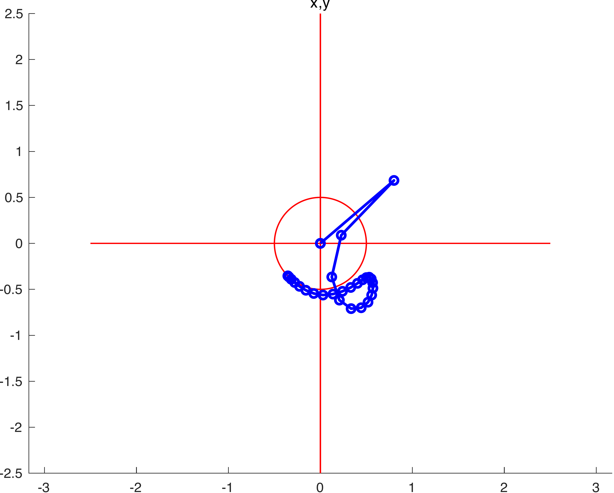

ODE solve example 9
===================

Load ODE
--------

Consider a double-slider system described by the following DAE (14 equations):

.. math::

  \begin{cases}
    x' = u & \\
    y' = v & \\
    \theta' = \omega & \\
    m u' - 2\lambda_2 = 0 & \\
    m v' + mg-\lambda_2 = 0 & \\
    \omega_1' = & \\
    \lambda_1 L \cos(theta) + \lambda_2 L \sin(\theta) = 0 & \\
    -\lambda_3 L \sin(\theta) = 0 & \\
    2y - L\sin(\theta) = 0 & \\
    2x - L\cos(\theta) = 0 &
  \end{cases}

If index is reduced, we obtain the ODE:

.. math::

  \begin{cases}
    x'         = u & \\
    y'         = v & \\
    \theta'    = \omega & \\
    u'         = \dfrac{2\lambda_2}{m} & \\
    v'         = \dfrac{2\lambda_2 - mg}{m} & \\
    omega'     = \dfrac{\lambda_3}{m} & \\
    \lambda_1' = \dfrac{\lambda_4 - mg}{m}  & \\
  \end{cases}

Define the class for the ODE to be integrated.
In this case the class ``DoubleSlider`` derived from
the base class ``DAC_ODEclass``.
The following is the contents of the file `CrankRod14EQ.m`

..
  :emphasize-lines: 18, 19, 20, 21, 80, 81, 82, 83, 146, 147, 148, 149, 203, 205, 206

.. code:: matlab

  classdef DoubleSlider < DAC_ODEclass
    properties (SetAccess = protected, Hidden = true)
      ell;
      m;
      gravity;
    end
    methods
      function self = DoubleSlider( ell, m, gravity )
        neq  = 8;
        ninv = 6;
        self@DAC_ODEclass( 'DoubleSlider', neq, ninv );
        self.ell     = ell;
        self.m       = m;
        self.gravity = gravity;
      end
      % - - - - - - - - - - - - - - - - - - - - - - - - - - - - - - - - - - -
      function res__f = f( self, t, vars__ )
        % extract parameters
        g = self.gravity;
        m = self.m;
        L = self.ell;
        % extract states
        x         = vars__(1);
        y         = vars__(2);
        theta     = vars__(3);
        u         = vars__(4);
        v         = vars__(5);
        omega     = vars__(6);
        lambda__1 = vars__(7);
        lambda__2 = vars__(8);
        % evaluate function
        res__1 = u;
        res__2 = v;
        res__3 = omega;
        t1 = 0.1e1 / m;
        res__4 = 2 * lambda__2 * t1;
        t3 = m * g;
        res__5 = t1 * (-t3 + 2 * lambda__1);
        t6 = sin(theta);
        t8 = omega ^ 2;
        t9 = t8 * m;
        t10 = t9 * t6 * L;
        t16 = cos(theta);
        t17 = 0.1e1 / t16;
        res__6 = t1 * t17 / L * (t10 - 2 * t3 + 4 * lambda__1);
        t19 = t16 ^ 2;
        t26 = t6 * lambda__1;
        res__7 = t17 * (-3 * t8 * m * L + 3 * t9 * t19 * L + 6 * m * g * t6 - 4 * t19 * t16 * lambda__2 + 4 * t19 * t26 - 12 * t26) * omega / 4;
        res__8 = (-4 * t16 * t6 * lambda__2 - 4 * t19 * lambda__1 + 3 * t10 - 6 * t3 + 16 * lambda__1) * omega / 4;
        % store on output
        res__f = zeros(8,1);
        res__f(1) = res__1;
        res__f(2) = res__2;
        res__f(3) = res__3;
        res__f(4) = res__4;
        res__f(5) = res__5;
        res__f(6) = res__6;
        res__f(7) = res__7;
        res__f(8) = res__8;
      end
      % - - - - - - - - - - - - - - - - - - - - - - - - - - - - - - - - - - -
      function res__DfDx = DfDx( self, t, vars__ )
        % extract parameters
        g = self.gravity;
        m = self.m;
        L = self.ell;
        % extract states
        x         = vars__(1);
        y         = vars__(2);
        theta     = vars__(3);
        u         = vars__(4);
        v         = vars__(5);
        omega     = vars__(6);
        lambda__1 = vars__(7);
        lambda__2 = vars__(8);
        % evaluate function
        res__1_1 = u;
        res__2_1 = v;
        res__3_1 = omega;
        t1 = 0.1e1 / m;
        res__4_1 = 2 * lambda__2 * t1;
        t3 = m * g;
        res__5_1 = t1 * (-t3 + 2 * lambda__1);
        t6 = sin(theta);
        t8 = omega ^ 2;
        t9 = t8 * m;
        t10 = t9 * t6 * L;
        t16 = cos(theta);
        t17 = 0.1e1 / t16;
        res__6_1 = t1 * t17 / L * (t10 - 2 * t3 + 4 * lambda__1);
        t19 = t16 ^ 2;
        t26 = t6 * lambda__1;
        res__7_1 = t17 * (-3 * t8 * m * L + 3 * t9 * t19 * L + 6 * m * g * t6 - 4 * t19 * t16 * lambda__2 + 4 * t19 * t26 - 12 * t26) * omega / 4;
        res__8_1 = (-4 * t16 * t6 * lambda__2 - 4 * t19 * lambda__1 + 3 * t10 - 6 * t3 + 16 * lambda__1) * omega / 4;
        % store on output
        res__DfDx = zeros(8,1);
        res__DfDx(1,1) = res__1_1;
        res__DfDx(2,1) = res__2_1;
        res__DfDx(3,1) = res__3_1;
        res__DfDx(4,1) = res__4_1;
        res__DfDx(5,1) = res__5_1;
        res__DfDx(6,1) = res__6_1;
        res__DfDx(7,1) = res__7_1;
        res__DfDx(8,1) = res__8_1;
      end
      % - - - - - - - - - - - - - - - - - - - - - - - - - - - - - - - - - - -
      function res__DfDt = DfDt( self, t, vars__ )
        res__DfDt = zeros(8,1);
      end
      % - - - - - - - - - - - - - - - - - - - - - - - - - - - - - - - - - - -
      function res__h = h( self, t, vars__ )
        % extract parameters
        g = self.gravity;
        m = self.m;
        L = self.ell;
        % extract states
        x         = vars__(1);
        y         = vars__(2);
        theta     = vars__(3);
        u         = vars__(4);
        v         = vars__(5);
        omega     = vars__(6);
        lambda__1 = vars__(7);
        lambda__2 = vars__(8);
        % evaluate function
        t1 = cos(theta);
        t3 = sin(theta);
        res__1 = -(lambda__1 * t1 + lambda__2 * t3) * L;
        res__2 = t3 * L - 2 * y;
        res__3 = -t1 * L - 2 * x;
        t12 = L * omega;
        res__4 = -t1 * t12 + 2 * v;
        res__5 = -t3 * t12 + 2 * u;
        t22 = omega ^ 2;
        res__6 = 0.1e1 / m / t1 * (t3 * (-2 * m * g + 4 * lambda__1) + t22 * m * L - 4 * lambda__2 * t1);
        % store on output
        res__h    = zeros(6,1);
        res__h(1) = res__1;
        res__h(2) = res__2;
        res__h(3) = res__3;
        res__h(4) = res__4;
        res__h(5) = res__5;
        res__h(6) = res__6;
      end
      % - - - - - - - - - - - - - - - - - - - - - - - - - - - - - - - - - - -
      function res__DhDx = DhDx( self, t, vars__ )
        % extract parameters
        g = self.gravity;
        m = self.m;
        L = self.ell;
        % extract states
        x         = vars__(1);
        y         = vars__(2);
        theta     = vars__(3);
        u         = vars__(4);
        v         = vars__(5);
        omega     = vars__(6);
        lambda__1 = vars__(7);
        lambda__2 = vars__(8);
        % evaluate function
        t1 = sin(theta);
        t3 = cos(theta);
        res__1_3 = (lambda__1 * t1 - lambda__2 * t3) * L;
        t6 = t3 * L;
        res__1_7 = -t6;
        t7 = t1 * L;
        res__1_8 = -t7;
        res__2_2 = -2;
        res__2_3 = t6;
        res__3_1 = -2;
        res__3_3 = t7;
        t8 = L * omega;
        res__4_3 = t1 * t8;
        res__4_5 = 2;
        res__4_6 = res__1_7;
        res__5_3 = -t3 * t8;
        res__5_4 = 2;
        res__5_6 = res__1_8;
        t10 = omega ^ 2;
        t17 = t3 ^ 2;
        t20 = 0.1e1 / m;
        res__6_3 = t20 / t17 * (t10 * m * res__3_3 - 2 * m * g + 4 * lambda__1);
        t21 = 0.1e1 / t3;
        res__6_6 = 2 * t21 * t8;
        res__6_7 = 4 * t20 * t21 * t1;
        res__6_8 = -4 * t20;
        % store on output
        res__DhDx      = zeros(6,8);
        res__DhDx(1,3) = res__1_3;
        res__DhDx(1,7) = res__1_7;
        res__DhDx(1,8) = res__1_8;
        res__DhDx(2,2) = res__2_2;
        res__DhDx(2,3) = res__2_3;
        res__DhDx(3,1) = res__3_1;
        res__DhDx(3,3) = res__3_3;
        res__DhDx(4,3) = res__4_3;
        res__DhDx(4,5) = res__4_5;
        res__DhDx(4,6) = res__4_6;
        res__DhDx(5,3) = res__5_3;
        res__DhDx(5,4) = res__5_4;
        res__DhDx(5,6) = res__5_6;
        res__DhDx(6,3) = res__6_3;
        res__DhDx(6,6) = res__6_6;
        res__DhDx(6,7) = res__6_7;
        res__DhDx(6,8) = res__6_8;
      end
      % - - - - - - - - - - - - - - - - - - - - - - - - - - - - - - - - - - -
      function res__DhDt = DhDt( self, t, vars__ )
        res__DhDt = zeros(6,1);
      end
      % - - - - - - - - - - - - - - - - - - - - - - - - - - - - - - - - - - -
      function plot( self, t, Z )
        DoubleSliderPlot( t, Z(1), Z(2), Z(3), self.ell );
      end
    end
  end

Instantiate the ODE
-------------------

Having `DoubleSlider.m` now can instantiate the ODE

.. code:: matlab

  % load the crank and rod model in the variable ode
  ell     = 1.0;
  m       = 1.0;
  gravity = 9.81;
  ode     = DoubleSlider( ell, m, gravity );

Choose solver
-------------

Choose `ExplicitEuler` as solver and attach the
instantiated ode to it.

.. code:: matlab

  solver = ExplicitEuler(); % initialize solver
  solver.setODE(ode);       % Attach ode to the solver

Integrate
---------

Select the range and the sampling point for the numerical solution

.. code:: matlab

  Tmax = 3.0;
  h    = 0.05;
  tt   = 0:h:Tmax;

setup initial condition, use hidden constraint

.. math::

  \begin{cases}
    2y - L\sin(\theta) = 0 & \\
    2x + L\cos(\theta) = 0 & \\
    2v - L\omega\cos(\theta) = 0 & \\
    2u - L\omega\sin(\theta) = 0 & \\
    2(-mg + 2\lambda_1)/m - (L\omega^2\sin(\theta)m - 2mg + 4\lambda_1)/m + L\omega^2\sin(\theta) = 0 & \\
    4\lambda_2/m - (L\omega^2\sin(\theta)m - 2mg + 4\lambda_1)\sin(\theta)/(\cos(\theta)m) - L\omega^2\cos(\theta) = 0 &
  \end{cases}

to set consistent initial conditions

.. code:: matlab

  angle     = -pi/4;
  speed     = 0.0;
  x_0       = -ell*cos(angle)/2;
  y_0       = ell*sin(angle)/2;
  theta_0   = angle;
  u_0       = speed*ell*cos(angle)/2;
  v_0       = speed*ell*sin(angle)/2;
  omega_0   = speed;
  lambda_10 = -ell*m*speed^2*sin(angle)/4 + sin(angle)^2*gravity*m/2;
  lambda_20 = cos(angle)*m*(ell*speed^2 - 2*sin(angle)*gravity)/4;
  ini       = [ x_0; y_0; theta_0; ...
                u_0; v_0; omega_0; ...
                lambda_10; lambda_20 ];

compute numerical solution

.. code:: matlab

  sol = solver.advance( tt, ini );

now the matrix ``sol`` contain the solution.
The first column contain \(\theta\) the second column
contains  \(\omega\).

Extract solution
----------------

.. code:: matlab

  x     = sol(1,:);
  y     = sol(2,:);
  theta = sol(3,:);

Plot the solution
-----------------

.. code:: matlab

  % sample a circle and plot (the constraint)
  x0 = 0;
  y0 = 0;
  close all;
  hold on;
  xc1 = ell/2*cos(0:pi/100:2*pi);
  yc1 = ell/2*sin(0:pi/100:2*pi);
  axis_lim = ell*2.5;
  xc2 = -axis_lim:0.05:axis_lim;
  yc2 = 0.0*(-axis_lim:0.05:axis_lim);
  plot( xc1, yc1, '-r', 'Linewidth', 1 );
  plot( xc2, yc2, '-r', 'Linewidth', 1 );
  plot( yc2, xc2, '-r', 'Linewidth', 1 );
  axis equal;
  plot( x, y, '-o', 'MarkerSize', 6, 'Linewidth', 2, 'Color', 'blue' );
  title('x,y');
  save_png('./images/Manual_ODE_TEST9_fig1');

.. code:: matlab

  ode.animate_plot( tt, sol, 10, 1 );

.. image:: ./images/Manual_ODE_TEST9_mov1.mp4
   :width: 90%
   :align: center
