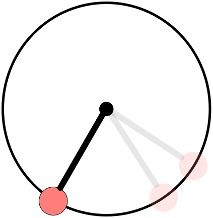
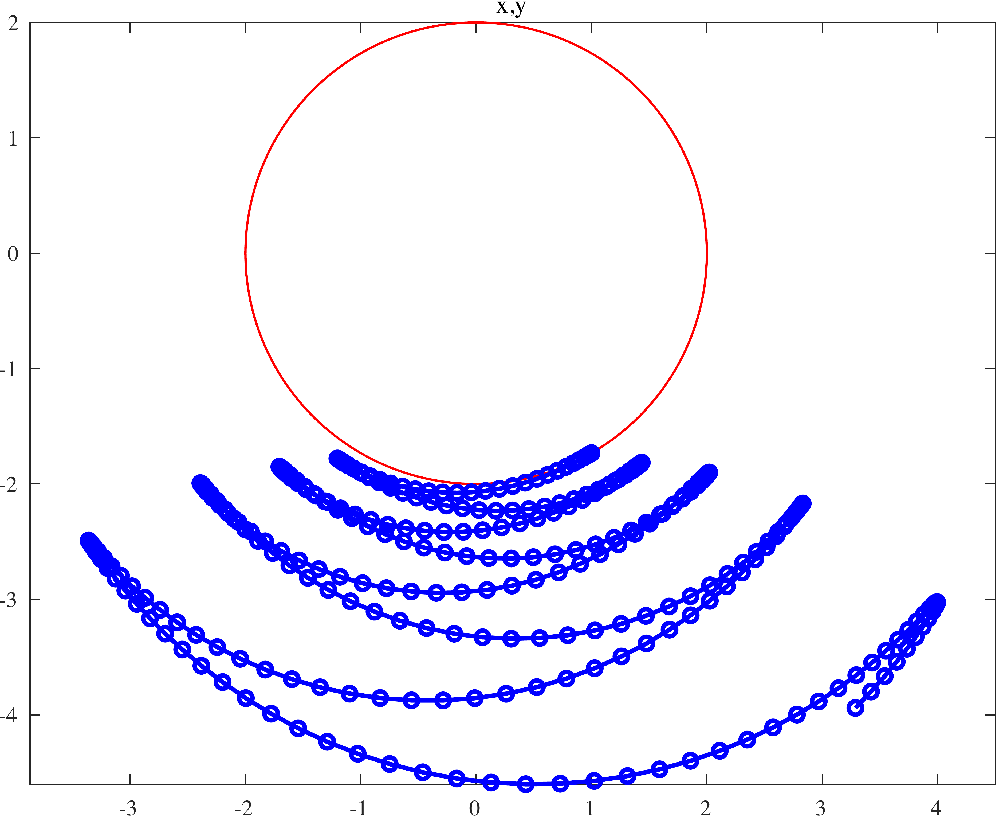

ODE solve example 2
===================

Load ODE
--------

Consider the ODE:

.. math::

  \begin{cases}
     x' = u & \\
     y' = v & \\
     u' = -\lambda x& \\
     v' = -\lambda y - g& \\
     \lambda' = -\displaystyle\frac{4\lambda(xu+yv)+3vg}{x^2+y^2}; &
  \end{cases}

MAPLE
-----

Load maple toolbox

.. code-block:: maple

    > read("{PATH}/DAE-toolbox.maplet");

Define ODE and constranints

.. code-block:: maple

    > EQ1 := diff(x(t),t)=u(t);
    > EQ2 := diff(y(t),t)=v(t);
    > EQ3 := m*diff(u(t),t)+lambda(t)*x(t)=0;
    > EQ4 := m*diff(v(t),t)+lambda(t)*y(t)=-m*g;
    > ALG := x(t)^2+y(t)^2=ell^2;

Define variables (and differential of its)

.. code-block:: maple

    > VARS  := [x(t),y(t),u(t),v(t),lambda(t)];
    > DVARS := map(diff,VARS,t)

Use toolbox to separate differential and algebraic
part and build the matrix ``E`` for differetial part of the DAE.

.. code-block:: maple

    > E1, G1, A1, r := DAE_separate_algebraic_bis( [EQ||(1..4),ALG], DVARS );

Reduce by 1 the index

.. code-block:: maple

    > E2, G2, A2, r := DAE_reduce_index_by_1( E1, G1, A1, DVARS );

Reduce (again) by 1 the index

.. code-block:: maple

    > E3, G3, A3, r := DAE_reduce_index_by_1( E2, G2, A2, DVARS );

Reduce (one more) by 1 the index

.. code-block:: maple

    > E4, G4, A4, r := DAE_reduce_index_by_1( E3, G3, A3, DVARS );

Now is an ODE, 3 index reduction appllyied,
original DAE of index 3.

.. code-block:: maple

    > RHS := collect(simplify(LinearSolve( E4, G4 )),[m,lambda]);

Build Jacobian of RHS of ODE:

.. code-block:: maple

    > JODE := map(simplify,JACOBIAN(RHS_ODE,VARS));

Build the map with the hidden constraints and its Jacobian:

.. code-block:: maple

    > A := <A1,A2,A3>;
    > JA := map(simplify,JACOBIAN(A,VARS));

MATLAB Class definition
-----------------------

Define the class for the ODE to be integrated.
In this case the class ``Pendulum5EQ`` derived from
the base class ``DAC_ODEclass``.
The following is the contents of the file `Pendulum5EQ.m`

.. code-block:: matlab

    classdef Pendulum5EQ < DAC_ODEclass
      properties (SetAccess = protected, Hidden = true)
        ell;
        mass;
        gravity;
      end
      methods
        % - - - - - - - - - - - - - - - - - - - - - - - - - - - - - - - - - - -
        function self = Pendulum5EQ( mass, ell, gravity )
          % call the constructor of the basic class
          neq  = 5;
          ninv = 3;
          self@DAC_ODEclass('Pendulum5EQ',neq,ninv);
          % setup of the parmater of the ODE
          self.mass    = mass;
          self.ell     = ell;
          self.gravity = gravity;
        end
        % - - - - - - - - - - - - - - - - - - - - - - - - - - - - - - - - - - -
        function res__f = f( self, t, vars__ )
          % ....
        end
        % - - - - - - - - - - - - - - - - - - - - - - - - - - - - - - - - - - -
        function res__DfDx = DfDx( self, t, vars__ )
          % ....
        end
        % - - - - - - - - - - - - - - - - - - - - - - - - - - - - - - - - - - -
        function res__h = h( self, t, vars__ )
          % ....
        end
        % - - - - - - - - - - - - - - - - - - - - - - - - - - - - - - - - - - -
        function res__DhDx = DhDx( self, t, vars__ )
          % ....
        end
        % - - - - - - - - - - - - - - - - - - - - - - - - - - - - - - - - - - -
        function plot( self, t, vars__ )
          % ....
        end
      end
    end

To define the methods you need the MAPLE
substitution (make a function ``fun(x)`` as the symbol ``fun``)

.. code-block:: maple

    > REMOVE_T := map(x->x=op(0,x),VARS);

Method f(t,x)
~~~~~~~~~~~~~

Implementation of RHS of ODE.
Use maple command

.. code-block:: maple

    > F_TO_MATLAB( <subs(REMOVE_T,RHS)>, subs(REMOVE_T,VARS), "f");

The lines highlighted which remap model parameters
are not automatically generated.

.. code-block:: matlab
    :emphasize-lines: 3-12

    function res__f = f( self, t, vars__ )
      m   = self.mass;
      ell = self.ell;
      g   = self.gravity;

      % extract states
      x      = vars__(1);
      y      = vars__(2);
      u      = vars__(3);
      v      = vars__(4);
      lambda = vars__(5);

      % evaluate function
      res__1 = u;
      res__2 = v;
      t1 = 0.1e1 / m;
      res__3 = -lambda * t1 * x;
      res__4 = t1 * (-m * g - y * lambda);
      t17 = x ^ 2;
      t18 = y ^ 2;
      res__5 = 0.1e1 / (t17 + t18) * (-3 * v * g * m - 4 * lambda * u * x - 4 * lambda * v * y);

      % store on output
      res__f = zeros(5,1);
      res__f(1) = res__1;
      res__f(2) = res__2;
      res__f(3) = res__3;
      res__f(4) = res__4;
      res__f(5) = res__5;

    end

Method DfDx(t,x)
~~~~~~~~~~~~~~~~

Implementation of Jacobians of RHS of ODE.
Use maple command

.. code-block:: maple

    > JF_TO_MATLAB( subs(REMOVE_T,JODE), subs(REMOVE_T,VARS), "DfDx");

The lines highlighted which remap model parameters
are not automatically generated.

.. code-block:: matlab
    :emphasize-lines: 2-4

    function res__DfDx = DfDx( self, t, vars__ )
      m   = self.mass;
      ell = self.ell;
      g   = self.gravity;

      % extract states
      x = vars__(1);
      y = vars__(2);
      u = vars__(3);
      v = vars__(4);
      lambda = vars__(5);

      % evaluate function
      res__1_3 = 1;
      res__2_4 = 1;
      t1 = 0.1e1 / m;
      res__3_1 = -lambda * t1;
      res__3_5 = -t1 * x;
      res__4_2 = res__3_1;
      res__4_5 = -t1 * y;
      t5 = v * g;
      t9 = x ^ 2;
      t13 = y ^ 2;
      t17 = v * lambda;
      t22 = t9 + t13;
      t23 = t22 ^ 2;
      t24 = 0.1e1 / t23;
      res__5_1 = t24 * (-4 * u * t13 * lambda + 4 * u * t9 * lambda + 6 * m * x * t5 + 8 * x * y * t17);
      res__5_2 = t24 * (8 * lambda * x * y * u + 6 * m * y * t5 + 4 * t13 * t17 - 4 * t9 * t17);
      t37 = 0.1e1 / t22;
      res__5_3 = -4 * lambda * t37 * x;
      res__5_4 = t37 * (-3 * m * g - 4 * y * lambda);
      res__5_5 = t37 * (-4 * x * u - 4 * y * v);

      % store on output
      res__DfDx = zeros(5,5);
      res__DfDx(1,3) = res__1_3;
      res__DfDx(2,4) = res__2_4;
      res__DfDx(3,1) = res__3_1;
      res__DfDx(3,5) = res__3_5;
      res__DfDx(4,2) = res__4_2;
      res__DfDx(4,5) = res__4_5;
      res__DfDx(5,1) = res__5_1;
      res__DfDx(5,2) = res__5_2;
      res__DfDx(5,3) = res__5_3;
      res__DfDx(5,4) = res__5_4;
      res__DfDx(5,5) = res__5_5;
    end

Method h(t,x)
~~~~~~~~~~~~~

Implementation of hidden constraints:
Use maple command

.. code-block:: maple

    > F_TO_MATLAB( subs(REMOVE_T,A), subs(REMOVE_T,VARS), "h");

The lines highlighted which remap model parameters
are not automatically generated.

.. code-block:: matlab
    :emphasize-lines: 2-4

    function res__h = h( self, t, vars__ )
      m   = self.mass;
      ell = self.ell;
      g   = self.gravity;

      % extract states
      x = vars__(1);
      y = vars__(2);
      u = vars__(3);
      v = vars__(4);
      lambda = vars__(5);

      % evaluate function
      t1 = ell ^ 2;
      t2 = x ^ 2;
      t3 = y ^ 2;
      res__1 = t1 - t2 - t3;
      res__2 = 2 * x * u + 2 * y * v;
      t8 = u ^ 2;
      t9 = v ^ 2;
      res__3 = 0.1e1 / m * (m * (2 * g * y - 2 * t8 - 2 * t9) + 2 * (t2 + t3) * lambda);

      % store on output
      res__h = zeros(3,1);
      res__h(1) = res__1;
      res__h(2) = res__2;
      res__h(3) = res__3;
    end

Method DhDx(t,x)
~~~~~~~~~~~~~~~~

Implementation of jacobian of hidden constraints:
Use maple command

.. code-block:: maple

    > JF_TO_MATLAB( subs(REMOVE_T,JA), subs(REMOVE_T,VARS), "DhDx");

The lines highlighted which remap model parameters
are not automatically generated.

.. code-block:: matlab
    :emphasize-lines: 2-4

    function res__DhDx = DhDx( self, t, vars__ )
      m   = self.mass;
      ell = self.ell;
      g   = self.gravity;

      % extract states
      x = vars__(1);
      y = vars__(2);
      u = vars__(3);
      v = vars__(4);
      lambda = vars__(5);

      % evaluate function
      t1       = 2 * x;
      res__1_1 = -t1;
      t2       = 2 * y;
      res__1_2 = -t2;
      res__2_1 = 2 * u;
      res__2_2 = 2 * v;
      res__2_3 = t1;
      res__2_4 = t2;
      t3       = 0.1e1 / m;
      res__3_1 = 4 * lambda * t3 * x;
      res__3_2 = t3 * (2 * m * g + 4 * lambda * y);
      res__3_3 = -4 * u;
      res__3_4 = -4 * v;
      t13      = x ^ 2;
      t14      = y ^ 2;
      res__3_5 = t3 * (2 * t13 + 2 * t14);

      % store on output
      res__DhDx = zeros(3,5);
      res__DhDx(1,1) = res__1_1;
      res__DhDx(1,2) = res__1_2;
      res__DhDx(2,1) = res__2_1;
      res__DhDx(2,2) = res__2_2;
      res__DhDx(2,3) = res__2_3;
      res__DhDx(2,4) = res__2_4;
      res__DhDx(3,1) = res__3_1;
      res__DhDx(3,2) = res__3_2;
      res__DhDx(3,3) = res__3_3;
      res__DhDx(3,4) = res__3_4;
      res__DhDx(3,5) = res__3_5;
    end

Method plot(t,x)
~~~~~~~~~~~~~~~~

Plotting the pendulum:

.. code-block:: matlab

    function plot( self, t, vars__ )
      % extract states
      x = vars__(1);
      y = vars__(2);
      u = vars__(3);
      v = vars__(4);

      tt = 0:pi/30:2*pi;
      xx = self.ell*cos(tt);
      yy = self.ell*sin(tt);
      hold off;
      plot(xx,yy,'LineWidth',2,'Color','red');
      LL = 1-self.ell/hypot(x,y);
      x0 = LL*x;
      y0 = LL*y;
      hold on;
      L = 1.5*self.ell;
      drawLine(-L,0,L,0,'LineWidth',2,'Color','k');
      drawLine(0,-L,0,L,'LineWidth',2,'Color','k');
      drawAxes(2,0.25,1,0,0);
      drawLine(x0,y0,x,y,'LineWidth',8,'Color','b');
      drawCOG( 0.1*self.ell, x0, y0 );
      fillCircle( 'r', x, y, 0.1*self.ell );
      axis([-L L -L L]);
      title(sprintf('time=%g',t));
      axis equal;
    end

MATLAB usage in script
----------------------

Instantiate the ODE
~~~~~~~~~~~~~~~~~~~

Having `Pendulum5EQ.m` now can instantiate the ODE

.. code:: matlab

  % load the Pendulum model in the variable ode
  ell     = 2;
  gravity = 9.81;
  ode     = Pendulum5EQ( ell, gravity );

Choose solver
~~~~~~~~~~~~~

Choose `ExplicitEuler` as solver and attach the
instantiated ode to it.

.. code:: matlab

  solver = ExplicitEuler(); % initialize solver
  solver.setODE(ode);       % Attach ode to the solver

Integrate
~~~~~~~~~

Select the range and the sam pling point for the numerical solution

.. code:: matlab

  Tmax = 5;
  h    = 0.05;
  tt   = 0:h:Tmax;

setup initial condition, use hidden constraint

.. math::

  \begin{cases}
     2(xu+yv)=0&\\
     2\left(u^2+v^2-(x^2+y^2)-yg\right)=0&
  \end{cases}

to set consistent initial consdition

.. code:: matlab

  theta0  = pi/6;
  omega0  = 0;
  x0      = ell*sin(theta0);
  y0      = -ell*cos(theta0);
  u0      = 0;
  v0      = 0;
  lambda0 = -(y0*gravity+u0^2+v0^2)/(x0^2+y0^2);
  ini     = [x0;y0;u0;v0;lambda0];

compute numerical solution

.. code:: matlab

  sol = solver.advance( tt, ini );

now the matrix ``sol`` contain the solution.
The first column contain \(\theta\) the second column
contains  \(\omega\).

Extract solution
~~~~~~~~~~~~~~~~

.. code:: matlab

  x = sol(1,:);
  y = sol(2,:);

Plot the solution
~~~~~~~~~~~~~~~~~

.. code:: matlab

  % sample a circle and plot (the constraint)
  xx = ell*cos(0:pi/100:2*pi);
  yy = ell*sin(0:pi/100:2*pi);
  plot( xx, yy, '-r', 'Linewidth', 1 );
  hold on
  axis equal
  plot( x, y, '-o', 'MarkerSize', 6, 'Linewidth', 2, 'Color', 'blue' );
  title('x,y');

.. code:: matlab

  ode.animate_plot( tt, sol, 10, 1 );

.. image:: ./images/Manual_ODE_TEST2_mov1.mp4
   :width: 90%
   :align: center
